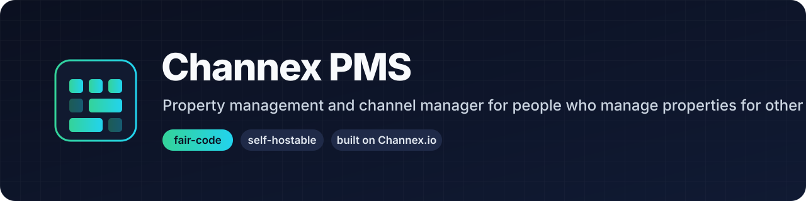

<p align="center">
  <a href="https://github.com/henihaddad/channex-pms">
    
  </a>
</p>

<h1 align="center">Channex PMS</h1>

<p align="center">
  <strong>The property management system for people who manage properties for other people.</strong><br>
  Channel manager, reservations, turnover operations, unified inbox, owner statements and a direct
  booking engine. Fair-code, self-hostable, built on the <a href="https://channex.io">Channex.io</a> connectivity API.
</p>

<p align="center">
  <a href="./LICENSE.md"></a>
  <a href="https://faircode.io"></a>
  <a href="./docs/specs/"></a>
  <a href="./docs/specs/15-roadmap.md"></a>
  <a href="https://github.com/henihaddad/channex-pms/actions/workflows/website.yml"></a>
</p>

<p align="center">
  <a href="./docs/specs/">Specification</a> ·
  <a href="./docs/specs/15-roadmap.md">Roadmap</a> ·
  <a href="./docs/specs/16-open-questions.md">Open questions</a> ·
  <a href="./CONTRIBUTING.md">Contributing</a> ·
  <a href="./website/">Website</a>
</p>

---

> **Status: v0.1 (milestone M2) shipped; M3 in progress.** The [specification](./docs/specs/) (17 documents,
> decided stack, M0 to M8 roadmap) is complete enough to build against. M0 (identity, tenancy with
> row-level security, permission matrix, audit log), M1 (the Channex sync engine, webhook receiver,
> booking ingestion with the ack loop, drift detection and a 200-scenario chaos suite) and M2
> (properties, the portfolio calendar, channel connections and mapping) are done. Reservations and
> operations arrive with M3. Everything so far has been proven against the built-in fake provider;
> a Channex staging key is the next thing this project needs.

## Why this exists

A short-term rental manager with 40 apartments pays for a channel manager, a PMS, a booking engine
and a cleaning app, then builds owner statements in a spreadsheet every month. Five logins, a few
thousand euros a month, and the one thing their actual clients see, the owner report, is the part no
vendor does well.

The expensive half of that stack is certified two-way connectivity to Booking.com, Airbnb, Vrbo,
Expedia and forty other channels. **Channex already does that half and exposes it as a plain REST
API.** So we build the other half, the product, in the open:

```
  Booking.com · Airbnb · Vrbo · Expedia · Agoda · 40+ more
                          │
                 ┌────────┴────────┐
                 │   Channex.io    │   certified OTA connectivity, ARI, bookings, messaging
                 └────────┬────────┘
                          │  REST + webhooks
                 ┌────────┴────────┐
                 │   Channex PMS   │   calendar, rates, roles, ops, inbox, owners, booking engine
                 └─────────────────┘
```

## Key capabilities

- **Portfolio-first channel manager**: connect OTAs, map inventory, push rates and availability,
  watch channel health, at 200 listings, not just 20.
- **Reservations that are never silently lost**: every OTA booking with full revision history,
  reconciled continuously against the provider.
- **Turnover operations instead of a front desk**: cleaning coordination, same-day changeovers, a
  cleaner app, access codes, self check-in, maintenance. Hotel-kind properties get a real front desk.
- **Unified guest inbox**: Booking.com, Airbnb and Expedia threads in one place, with templates,
  automation and response-time SLAs.
- **Owner management, the module no channel manager ships**: agreements, auto-generated monthly
  statements, expenses, payouts and an owner portal.
- **Commission-free direct booking engine**: multi-property search, treated as a first-class channel.
- **Dashboards per role**: occupancy, ADR, RevPAR, pace and channel mix.
- **Real roles**: fifteen personas from org owner to cleaner to property owner, scoped grants,
  everything audited.
- **Self-hosted or hosted, same codebase**: no crippled community build. Your data is yours and
  exportable at any time.

## Quick start

For contributors (Node 22, pnpm 10, Docker):

```sh
git clone https://github.com/henihaddad/channex-pms.git
cd channex-pms
pnpm install
cp .env.example .env
pnpm infra:up          # Postgres 16, Redis 7, MinIO
pnpm dev               # apps/web on :3000, apps/worker
pnpm check             # lint, typecheck, test, build
```

Self-hosting is one command with Docker Compose (`compose.selfhost.yml`: web, worker, one-shot
migrate, Postgres, Redis, MinIO, Caddy):

```sh
# v0.1: set PMS_MASTER_KEY, PMS_SESSION_KEY, CHANNEX_API_KEY and PUBLIC_URL in .env first
docker compose up
```

The target is under sixty minutes from `docker compose up` to the first OTA booking on screen.

## Self-hosted and hosted, with a parity guarantee

Both run from this repository. The hosted service exists so that operators who do not want to run
servers can still use the product; it is not a way to hold features back. Features are never
paywalled in the self-hosted edition, and the only enterprise-licensed files are the ones marked
`.ee.` (see [Licence](#licence)).

## Roadmap

| Milestone | Delivers                                                                | Status |
| --------- | ----------------------------------------------------------------------- | ------ |
| M0        | Monorepo, CI, Compose, domain value objects, permission matrix          | done   |
| M1        | Connectivity core: Channex adapter, ARI engine, fake provider           | done   |
| M2        | Inventory, portfolio calendar, channel connection. First usable release | v0.1   |
| M3        | Reservations and turnover operations                                    | next   |
| M4        | Unified messaging                                                       |        |
| M5        | Owner management                                                        |        |
| M6        | Dashboards and reporting                                                |        |
| M7        | Direct booking engine                                                   |        |
| M8        | Hosted service, billing, hardening to v1.0                              |        |

Full detail, including what each milestone deliberately leaves out, in
[docs/specs/15-roadmap.md](./docs/specs/15-roadmap.md).

## Resources

- 📐 [Specification](./docs/specs/README.md): 17 documents, the design source of truth
- 🧭 [Vision & Scope](./docs/specs/01-vision-and-scope.md): what this is, and what it deliberately is not
- 🔌 [Channex Integration](./docs/specs/05-channex-integration.md): the sync engine in detail
- 👥 [Personas & RBAC](./docs/specs/02-personas-and-rbac.md): the role model
- 🏠 [Owner Management](./docs/specs/17-owner-management.md): agreements, statements, payouts
- 🗺️ [Roadmap](./docs/specs/15-roadmap.md): M0 to M8 to v1
- ❓ [Open Questions](./docs/specs/16-open-questions.md): decisions still to make, opinions welcome

## Design principles

1. Never silently lose a booking.
2. Local state is authoritative for availability and rates; provider state is a mirror we
   continuously verify.
3. Every mutation is attributable: who, when, from where.
4. Optimistic UI, honest state: a pending sync always looks pending.
5. Boring, inspectable technology.
6. Accessible and multilingual from day one.

## Support and community

- 💬 [GitHub Discussions](https://github.com/henihaddad/channex-pms/discussions) for questions and ideas
- 🐛 [Issues](https://github.com/henihaddad/channex-pms/issues) for bugs and spec feedback
- 🔒 [Security policy](./SECURITY.md) for vulnerabilities, reported privately

If you manage 5 to 300 units and would run an early release on a real portfolio, open an issue
titled `Design partner: <your region>`. A real portfolio on the M2 release matters more than
anything else on the roadmap.

## Contributing

The most useful contribution right now is disagreement. If you run a property or have built
distribution software, start with the [open questions](./docs/specs/16-open-questions.md). Read
[CONTRIBUTING.md](./CONTRIBUTING.md) for the development cycle and the
[Contributor License Agreement](./CONTRIBUTOR_LICENSE_AGREEMENT.md) (four sentences, signed once).

## Licence

Channex PMS is [fair-code](https://faircode.io) distributed under the
[Sustainable Use License](./LICENSE.md) and the
[Channex PMS Enterprise License](./LICENSE_EE.md).

- **Source available**: the whole codebase is public, always.
- **Self-hostable**: run it anywhere, for your own business, free of charge.
- **Extensible**: the [SDK, plugin interfaces and booking widget](./LICENSE.md) are Apache-2.0, so
  integrations and embeds carry no restrictions.

What the Sustainable Use License does not allow is reselling the platform: hosting it and charging
others for access, or white-labelling it inside a product you sell. That needs an
[enterprise licence](./LICENSE_EE.md). Consulting, building integrations and running it for your own
portfolio, however large, are all fine.

## About the name

"Channex PMS" is a working title. It borrows a trademark and couples the project to one provider,
which is why a real name is [open question Q9](./docs/specs/16-open-questions.md#q9--name-and-brand).
This project is not affiliated with or endorsed by Channex.io.
