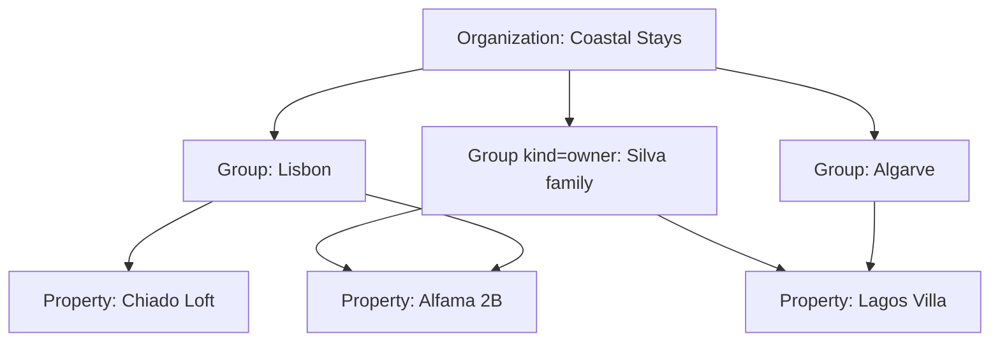

# 02 — Personas & Role-Based Access Control

**Status:** `accepted` (2026-09-02) — `packages/authz` is generated from §2.3 and §2.4; the matrix test fails on drift. Sensitive permissions reach a role only through a `!` cell.
and operations roles added).

Access control is the feature most closed channel managers get wrong: they ship two
roles ("admin" and "not admin"), so the cleaner can wipe a rate plan and the owner
cannot see a single statement. For a manager operating other people's assets, this
is not a convenience — it is the basis of the commercial relationship. We treat
authorisation as a core domain.

## 2.1 Model in one line

> A **grant** binds a **subject** to a **role** within a **scope**, optionally
> narrowed by **overrides**.

```
grant = (subject, role, scope, overrides?, expires_at?)
```

- **Subject** — a user, a service account, or an unaccepted invitation.
- **Role** — a named, versioned bundle of permissions (system or custom).
- **Scope** — `organization` | `group` | `property`. Permissions cascade downward.
- **Overrides** — explicit `allow` / `deny` on individual permissions. `deny` wins
  at any level.
- **`expires_at`** — optional. Contractors, seasonal cleaners and support access
  should expire on their own.

Everything is **deny by default**. No grant means no data; an unknown permission
string evaluates to deny.

### Scope resolution



A grant on `G1` covers `P1` and `P2`. A property can belong to several groups — a
city cluster *and* an owner group — so a subject's effective permissions are the
**union of allows minus the union of denies** across every path that reaches it.
This is exactly how an STR portfolio is organised in practice, and it is why scope
had to be a graph rather than a tree.

> **Channex parity.** Channex property users are `owner` or `user` plus a JSON
> access-policy override, and groups bundle properties. Our model is a strict
> superset. When provisioning Channex-side users (only needed if a human logs into
> Channex directly), `org_owner` and `property_manager` map to `owner`, everything
> else to `user` plus overrides. Our own roles are enforced in *our* application —
> we never rely on Channex for authorisation.

## 2.2 Personas and system roles

| Role key | Persona | Default scope | What their day looks like |
|---|---|---|---|
| `platform_operator` | SaaS operator / self-host sysadmin | **outside** tenancy | Provisions tenants, watches queues and connector health, handles escalations. Cannot read guest PII or messages without a consented, audited impersonation session. |
| `org_owner` | Founder of the management company | organization | Full control: billing, tenancy, connectivity credentials, owner agreements, destructive actions. At least one per org, always. |
| `org_admin` | Head of ops | organization | Everything except billing, ownership transfer and org deletion. |
| `portfolio_manager` | City / cluster manager | group | Compares listings, sets pricing strategy for the cluster, manages staff and owners within it. The most common senior role at STR scale. |
| `property_manager` | Manager of specific listings | property | Owns a set of listings end to end: content, channels, rates, operations, the owner relationship. |
| `revenue_manager` | Revenue / distribution | group or property | Lives in the portfolio calendar and rate grid. Bulk edits, yield rules, restrictions, pace. Does **not** manage staff, owners or billing. |
| `reservations_agent` | Bookings / guest services | property or group | Bookings, modifications, access credentials, guest messages, front desk where the property is a hotel. Cannot change published rates or channel mappings. |
| `ops_coordinator` | Turnover / cleaning coordinator | group | **The STR operational hub.** Builds the daily turnover schedule, assigns crews, triages maintenance, chases same-day changeovers. |
| `cleaner` | Cleaner or cleaning company | property or group | Their own assigned tasks, checklists, photos, unit status. Mobile-only. No rates, no guest financials, no messaging, no other cleaners' work. |
| `maintenance_tech` | Handyman / contractor | property or group | Assigned maintenance issues, photos, costs, unit status. Often an external contractor — hence expiring grants and a narrow surface. |
| `guest_relations` | Guest comms / reviews | property or group | The unified inbox, templates, reviews. Booking context, not payment data. |
| `finance` | Bookkeeper / accountant | organization or group | Folios, invoices, owner statements, payouts, commission and tax reports, exports. Read-only on operations. |
| `owner` | **Property owner (external)** | property (their own) | Their own listings only: calendar, bookings (limited guest detail), statements, payouts, expenses, and blocking dates for their own stays. Never sees other owners' anything. |
| `viewer` | Investor, asset manager, analyst | any | Read-only dashboards and reports. No guest PII by default. |
| `service_account` | Integration / script | any | API-key or OAuth identity. Permissions always explicitly enumerated — no role defaults. |

**Not a role: the guest.** Guests exist in a separate identity space with no
staff-console access ([10](./10-booking-engine.md)): magic-link authentication to a
booking-scoped portal, able to see only their own reservation.

### Why `owner` is a first-class role, not a report

An STR manager's client is the owner. Owners currently receive a monthly PDF and
call to ask why March was lower than February. Giving them a real, permission-scoped
login — their calendar, their bookings, their statement with every line traceable —
removes a whole category of support work and is the clearest reason for a manager to
switch. It also means owner data isolation must be provably correct, since owners are
frequently each other's competitors.

## 2.3 Permission catalogue

Permissions are `resource:action`. Actions: `read`, `create`, `update`, `delete`,
`execute`.

| Domain | Permissions |
|---|---|
| Organization | `org:read`, `org:update`, `org:delete`, `org:transfer_ownership` |
| Group | `group:read|create|update|delete` |
| Property | `property:read|create|update|delete`, `property:publish_content`, `property:clone`, `property:bulk_import` |
| People | `member:read`, `member:invite`, `member:update_role`, `member:remove`, `role:manage_custom` |
| Inventory | `room_type:read|create|update|delete`, `rate_plan:read|create|update|delete`, `unit:read|create|update|delete` |
| ARI | `ari:read`, `ari:update_availability`, `ari:update_rate`, `ari:update_restriction`, `ari:bulk_execute`, `ari:force_resync` |
| Yielding | `yield_rule:read|create|update|delete`, `yield_rule:execute` |
| Channels | `channel:read`, `channel:create`, `channel:update_settings`, `channel:update_mapping`, `channel:activate`, `channel:deactivate`, `channel:delete`, `channel:read_credentials`, `channel_account:manage` |
| Reservations | `booking:read`, `booking:read_pii`, `booking:read_payment_instrument`, `booking:create`, `booking:modify`, `booking:cancel`, `booking:assign_unit`, `booking:check_in_out`, `booking:resolve_unmapped` |
| Access | `access_credential:read`, `access_credential:issue`, `access_credential:revoke` |
| Operations | `turnover:read`, `turnover:read_own`, `turnover:update`, `turnover:assign`, `turnover:complete`, `unit:update_status`, `maintenance:read`, `maintenance:create`, `maintenance:update`, `maintenance:assign`, `block:manage`, `checklist:manage`, `note:create` |
| Finance | `folio:read|update`, `charge:create`, `payment:capture`, `payment:refund`, `invoice:issue`, `tax:manage` |
| Owners | `owner:read`, `owner:create`, `owner:update`, `agreement:read`, `agreement:manage`, `statement:read`, `statement:read_own`, `statement:generate`, `statement:approve`, `statement:send`, `expense:read`, `expense:create`, `expense:approve`, `payout:read`, `payout:execute` |
| Messaging | `message:read`, `message:send`, `message:close_thread`, `template:read|manage`, `automation:manage` |
| Reviews | `review:read`, `review:respond` |
| Insight | `report:read`, `report:read_financial`, `report:read_own`, `export:execute`, `audit:read` |
| Platform | `api_key:read|create|revoke`, `webhook:manage`, `plugin:read|install|configure`, `billing:read|manage`, `impersonation:execute` |

### Sensitive permissions

Never included in any system role; granted deliberately only:

- `booking:read_payment_instrument` — masked card metadata. Gated, audited per read,
  rate-limited per subject.
- `channel:read_credentials` / `channel_account:manage` — OTA credentials and tokens.
- `payout:execute` — moves real money to owners. Step-up auth, and four-eyes where
  the org enables it.
- `impersonation:execute` — see §2.7.
- `org:delete` / `property:delete` — irreversible, step-up auth.

### `*_own` permissions

`turnover:read_own`, `statement:read_own` and `report:read_own` are **row-filtered**
variants: the subject sees only rows they are the assignee or the owner of. They are
enforced in the query, never by post-filtering, and they are what make the `cleaner`
and `owner` roles safe.

## 2.4 Role → permission matrix

`✓` full · `R` read only · `·` none · `!` granted but requires step-up auth ·
`○` off by default, grantable via override · `⊙` own rows only

| Domain | `org_owner` | `org_admin` | `portfolio_manager` | `property_manager` | `revenue_manager` | `reservations_agent` | `ops_coordinator` | `cleaner` | `maintenance_tech` | `guest_relations` | `finance` | `owner` | `viewer` |
|---|---|---|---|---|---|---|---|---|---|---|---|---|---|
| Organization | ✓ | R+update | R | R | R | · | R | · | · | · | R | · | R |
| Groups | ✓ | ✓ | R+update | R | R | · | R | · | · | · | R | · | R |
| Properties | ✓ | ✓ | ✓ | ✓ | R | R | R | R⊙ | R⊙ | R | R | R⊙ | R |
| Clone / bulk import property | ✓ | ✓ | ✓ | ○ | · | · | · | · | · | · | · | · | · |
| People & roles | ✓ | ✓ | ✓ (group) | ✓ (property) | · | · | ○ crews | · | · | · | · | · | · |
| Custom roles | ✓ | ✓ | · | · | · | · | · | · | · | · | · | · | · |
| Room types / units | ✓ | ✓ | ✓ | ✓ | R | R | R | R⊙ | R⊙ | · | R | R⊙ | R |
| Rate plans | ✓ | ✓ | ✓ | ✓ | ✓ | R | · | · | · | · | R | R⊙ | R |
| ARI (avail/rates/restrictions) | ✓ | ✓ | ✓ | ✓ | ✓ | ○ avail | · | · | · | · | R | R⊙ | R |
| Bulk ARI + force resync | ✓ | ✓ | ✓ | ✓ | ✓ | · | · | · | · | · | · | · | · |
| Yield rules | ✓ | ✓ | ✓ | ✓ | ✓ | · | · | · | · | · | · | · | R |
| Channel settings & mapping | ✓ | ✓ | ✓ | ✓ | R | · | · | · | · | · | · | · | R |
| Channel accounts / credentials | ! | ! | ○ | ○ | · | · | · | · | · | · | · | · | · |
| Bookings (read) | ✓ | ✓ | ✓ | ✓ | ✓ | ✓ | ✓ | ⊙ today | ⊙ | ✓ | ✓ | R⊙ limited | R aggregate |
| Guest PII | ✓ | ✓ | ✓ | ✓ | ○ | ✓ | ○ name only | · | · | ✓ | ✓ | · | ○ |
| Payment instrument | ! | ! | ○ | ! | · | ! | · | · | · | · | ! | · | · |
| Create / modify / cancel booking | ✓ | ✓ | ✓ | ✓ | ○ | ✓ | · | · | · | · | · | · | · |
| Assign unit, check in/out | ✓ | ✓ | ✓ | ✓ | · | ✓ | ✓ | · | · | · | · | · | · |
| Access credentials | ✓ | ✓ | ✓ | ✓ | · | ✓ | ○ | · | · | ○ | · | · | · |
| Unmapped booking queue | ✓ | ✓ | ✓ | ✓ | ✓ | ○ | · | · | · | · | · | · | · |
| Turnover board | ✓ | ✓ | ✓ | ✓ | · | R | ✓ | ⊙ | · | · | · | R⊙ | R |
| Assign crews / tasks | ✓ | ✓ | ✓ | ✓ | · | · | ✓ | · | · | · | · | · | · |
| Unit status | ✓ | ✓ | ✓ | ✓ | · | ✓ | ✓ | ⊙ | ⊙ | · | · | · | · |
| Maintenance | ✓ | ✓ | ✓ | ✓ | · | create | ✓ | create | ⊙ | · | R | R⊙ + create | R |
| Blocks (incl. owner stays) | ✓ | ✓ | ✓ | ✓ | ○ | ○ | ✓ | · | · | · | · | ⊙ own stays | · |
| Folios & charges | ✓ | ✓ | ✓ | ✓ | · | ✓ | · | · | · | · | ✓ | · | R⊙ |
| Capture / refund payment | ! | ! | ○ | ! | · | ○ | · | · | · | · | ! | · | · |
| Invoices & tax | ✓ | ✓ | R | R | · | R | · | · | · | · | ✓ | R⊙ | R |
| Owners & agreements | ✓ | ✓ | ✓ | R | · | · | · | · | · | · | R | R⊙ own | · |
| Statements: generate/approve/send | ✓ | ✓ | ✓ | ○ | · | · | · | · | · | · | ✓ | · | · |
| Statements: read | ✓ | ✓ | ✓ | ✓ | · | · | · | · | · | · | ✓ | ⊙ | ○ |
| Expenses | ✓ | ✓ | ✓ | ✓ create | · | · | ✓ create | create | create | · | ✓ approve | R⊙ | · |
| Payouts | ! | ! | R | · | · | · | · | · | · | · | ! | R⊙ | · |
| Guest messaging | ✓ | ✓ | ✓ | ✓ | · | ✓ | ○ | · | · | ✓ | · | · | · |
| Templates & automation | ✓ | ✓ | ✓ | ✓ | · | R | ○ | · | · | ✓ | · | · | · |
| Reviews | ✓ | ✓ | ✓ | ✓ | R | R | · | · | · | ✓ | · | R⊙ | R |
| Operational reports | ✓ | ✓ | ✓ | ✓ | ✓ | R | ✓ | · | · | R | ✓ | ⊙ | ✓ |
| Financial reports | ✓ | ✓ | ✓ | ✓ | R | · | · | · | · | · | ✓ | ⊙ | ○ |
| Exports | ✓ | ✓ | ✓ | ✓ | ✓ | ○ | ○ | · | · | ○ | ✓ | ⊙ | ○ |
| Audit log | ✓ | ✓ | R (group) | R (property) | · | · | · | · | · | · | R | · | · |
| API keys & webhooks | ✓ | ✓ | ○ | ○ | · | · | · | · | · | · | · | · | · |
| Plugins | ✓ | ✓ | ○ | ○ | · | · | · | · | · | · | · | · | · |
| Billing | ✓ | · | · | · | · | · | · | · | · | · | R | · | · |

This table is **normative**: `packages/authz/roles.ts` is generated from it and a
test asserts they agree. Changing a cell means changing the spec.

## 2.5 Custom roles

`org_owner` / `org_admin` may clone a system role and adjust it. Custom roles:

- are scoped to the owning organization;
- can never include a permission the editing subject does not itself hold (no
  privilege escalation by role authoring);
- are versioned — editing creates a new version, existing grants keep theirs until
  migrated, and the audit log records both;
- cannot be deleted while grants reference them.

**Presets we ship as examples:** *Cleaning Company* (own tasks across a group,
90-day expiry), *Co-host* (one property, bookings + messaging + calendar, no
financials), *OTA Consultant* (channels + ARI + reports, no PII, 90-day expiry),
*Owner with Booking Rights* (owner plus the ability to block and take direct
bookings on their own unit), *Night Auditor* (bookings + financial reports, no rate
access).

## 2.6 Authentication and step-up

- Email + password (Argon2id) plus **TOTP 2FA**; WebAuthn/passkeys planned.
- **OIDC / SAML SSO** with domain auto-provisioning for larger tenants; SSO group
  claims may map to grants.
- Owners and cleaners get **passwordless magic-link login** by default — they log in
  rarely, and a forgotten password is the main reason an owner portal goes unused.
- Sessions are short-lived JWT access tokens (≤15 min) with rotating refresh tokens
  bound to a device fingerprint; server-side revocation for "sign out everywhere".
- **Step-up (`!`) actions** require re-authentication within the last 5 minutes and
  are always audited with actor, reason and IP: payment capture/refund, **executing
  an owner payout**, reading card metadata or channel credentials, deleting a
  property or org, transferring ownership, removing the last owner's access.
- **Optional four-eyes mode** (per org) for bulk ARI operations above a configurable
  blast radius, and for owner payouts above a configurable amount.
- Enforceable IP allowlists per grant for `service_account` and `platform_operator`.

## 2.7 Impersonation and break-glass

1. `platform_operator` requests impersonation of a tenant with a written reason.
2. An `org_owner` or `org_admin` approves, or the tenant has pre-granted time-boxed
   support access in settings.
3. The session is capped (default 60 min), read-only unless write is explicitly
   approved, and **PII is redacted by default**.
4. A persistent banner shows the tenant's users and the operator that impersonation
   is active. It appears in the tenant's own audit log.
5. Every request is tagged `impersonated_by` and retained for two years.

Break-glass (no tenant available to approve) exists for incident response, is
limited to `org_owner`-level read, emails the tenant immediately, and requires two
operators to authorise.

## 2.8 Service accounts

- Belong to an organization, hold explicitly enumerated permissions, never a role.
- Credentials: API key (`cx_live_…` / `cx_test_…`, shown once, stored hashed) or
  OAuth2 client-credentials for partner integrations.
- Mandatory: 90-day rotation reminders, per-key rate limits and scopes, optional IP
  allowlist, and a last-used timestamp so dead keys can be found.
- Actions appear in the audit log attributed to the key **and** the human who
  created it.

## 2.9 Requirements

- **RBAC-1** Every Server Action and route handler MUST declare its required
  permission through `withPermission`; the build MUST fail on any unwrapped handler
  ([14 §14.3](./14-tech-stack.md#143-the-three-non-negotiable-conditions)).
- **RBAC-2** Authorisation MUST be evaluated server-side per request. UI hiding is a
  convenience, never a control.
- **RBAC-3** List queries MUST filter by scope in SQL, not after fetching. No
  out-of-scope row may leave the database — this includes `*_own` filtering.
- **RBAC-4** Every organization MUST retain at least one active `org_owner`.
- **RBAC-5** No subject may remove or de-escalate their own last grant (matching
  Channex's "user cannot withdraw themself").
- **RBAC-6** Permission changes MUST take effect within 60 seconds for active
  sessions.
- **RBAC-7** Denied requests MUST return `403` with a stable machine-readable code
  and the missing permission — never a message that leaks out-of-scope resources.
- **RBAC-8** The permission catalogue MUST be introspectable at
  `GET /v1/authz/permissions` so plugins and UIs stay in sync.
- **RBAC-9** A dedicated test suite MUST prove that an `owner` subject cannot read
  any row belonging to another owner, through any endpoint, action, export or
  report. This is the isolation guarantee the commercial relationship rests on.
