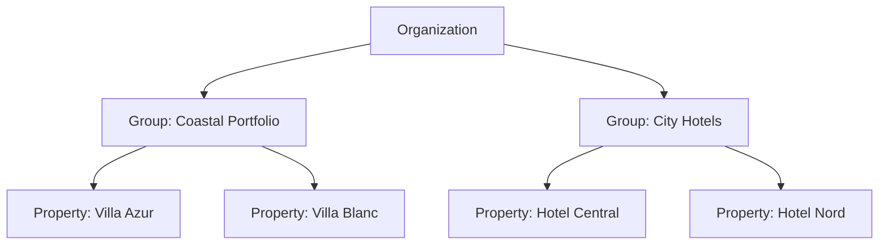

# 02 — Personas & Role-Based Access Control

**Status:** `draft`

Access control is the feature most closed channel managers get wrong: they ship
two roles ("admin" and "not admin"), so the night receptionist can wipe a rate
plan and the owner's accountant cannot see a single report. We treat authorisation
as a core domain, not an afterthought.

## 2.1 Model in one line

> A **grant** binds a **subject** to a **role** within a **scope**, optionally
> narrowed by **overrides**.

```
grant = (subject, role, scope, overrides?, expires_at?)
```

- **Subject** — a user, a service account, or an invitation not yet accepted.
- **Role** — a named, versioned bundle of permissions (system or custom).
- **Scope** — `organization` | `group` | `property`. Permissions cascade
  downward: a grant at group level applies to every property in that group.
- **Overrides** — explicit `allow` / `deny` on individual permissions. `deny`
  always wins, at any level.
- **`expires_at`** — optional. Contractors, seasonal staff, and support access
  should expire on their own.

Everything is **deny by default**. A subject with no grant sees no data, and an
unknown permission string evaluates to deny, never allow.

### Scope resolution



A grant on `G1` covers `P1` and `P2`. A `deny` override on `P2` removes it there
and nowhere else. A property can belong to more than one group — a subject's
effective permission set is the **union of allows minus the union of denies**
across all paths that reach it.

> **Channex parity.** Channex property users are `owner` or `user` plus a JSON
> access-policy override object, and groups exist to bundle properties. Our model
> is a strict superset. When we provision Channex-side users (only needed if a
> human logs into Channex directly), `org_owner` and `property_manager` map to
> `owner`; everything else maps to `user` plus overrides. Our own roles are
> enforced in *our* API — we never rely on Channex for authorisation.

## 2.2 Personas and system roles

| Role key | Persona | Default scope | What their day looks like |
|---|---|---|---|
| `platform_operator` | SaaS operator / self-host sysadmin | **outside** tenancy | Provisions tenants, watches queues and connector health, handles support escalations. Cannot read guest PII or messages without a consented, audited impersonation session. |
| `org_owner` | Founder / hotel owner | organization | Full control including billing, tenancy, connectivity credentials, and destructive actions. At least one per org, always. |
| `org_admin` | Head of ops / IT | organization | Everything the owner can do except billing, ownership transfer, and org deletion. |
| `portfolio_manager` | Regional / cluster manager | group | Compares properties, sets group-wide rate strategy, manages staff within the group. |
| `property_manager` | General manager | property | Owns one property end to end: inventory, channels, rates, staff, reports. |
| `revenue_manager` | Revenue / distribution manager | group or property | Lives in the calendar and the rate grid. Bulk edits, yield rules, restrictions, competitor and pace reports. Does **not** manage staff or billing. |
| `reservations_agent` | Front desk / reservations | property | Bookings, check-in/out, room assignment, folios, guest messages. Cannot change published rates or channel mappings. |
| `housekeeping` | Housekeeping supervisor / attendant | property | The housekeeping board and room status only. No rates, no guest financials, no messaging. Mobile-first. |
| `guest_relations` | Guest comms / social team | property or group | The unified inbox, templates, reviews. Sees booking context, not payment data. |
| `finance` | Bookkeeper / accountant | organization or group | Folios, invoices, payouts, commission and tax reports, exports. Read-only on operations. |
| `viewer` | Owner, investor, asset manager | any | Read-only dashboards and reports. No guest PII by default. |
| `service_account` | Integration / script | any | API-key or OAuth client identity. Permissions are always explicitly enumerated — service accounts get no role defaults. |

**Not a role: the guest.** Guests exist in a separate identity space with no
staff-console access ([10](./10-booking-engine.md)). They authenticate by magic
link to a booking-scoped portal and can only ever see their own reservation.

## 2.3 Permission catalogue

Permissions are `resource:action`. Actions: `read`, `create`, `update`, `delete`,
`execute`. Grouping is for documentation; the check is always on the exact string.

| Domain | Permissions |
|---|---|
| Organization | `org:read`, `org:update`, `org:delete`, `org:transfer_ownership` |
| Group | `group:read`, `group:create`, `group:update`, `group:delete` |
| Property | `property:read`, `property:create`, `property:update`, `property:delete`, `property:publish_content` |
| People | `member:read`, `member:invite`, `member:update_role`, `member:remove`, `role:manage_custom` |
| Inventory | `room_type:read|create|update|delete`, `rate_plan:read|create|update|delete` |
| ARI | `ari:read`, `ari:update_availability`, `ari:update_rate`, `ari:update_restriction`, `ari:bulk_execute`, `ari:force_resync` |
| Yielding | `yield_rule:read|create|update|delete`, `yield_rule:execute` |
| Channels | `channel:read`, `channel:create`, `channel:update_settings`, `channel:update_mapping`, `channel:activate`, `channel:deactivate`, `channel:delete`, `channel:read_credentials` |
| Reservations | `booking:read`, `booking:read_pii`, `booking:read_payment_instrument`, `booking:create`, `booking:modify`, `booking:cancel`, `booking:assign_room`, `booking:check_in_out`, `booking:resolve_unmapped` |
| Front desk | `housekeeping:read`, `housekeeping:update`, `room:update_status`, `note:create` |
| Finance | `folio:read|update`, `charge:create`, `payment:capture`, `payment:refund`, `invoice:issue`, `payout:read`, `tax:manage` |
| Messaging | `message:read`, `message:send`, `message:close_thread`, `template:read|manage`, `automation:manage` |
| Reviews | `review:read`, `review:respond` |
| Insight | `report:read`, `report:read_financial`, `export:execute`, `audit:read` |
| Platform surface | `api_key:read|create|revoke`, `webhook:manage`, `plugin:read|install|configure`, `billing:read|manage`, `impersonation:execute` |

### Sensitive permissions

Four are never included in any system role and must be granted deliberately:

- `booking:read_payment_instrument` — masked card metadata. Gated, audited on
  every read, and rate-limited per subject.
- `channel:read_credentials` — OTA credentials and tokens.
- `impersonation:execute` — see §2.7.
- `org:delete` / `property:delete` — irreversible, require step-up auth (§2.6).

## 2.4 Role → permission matrix

`✓` full · `R` read only · `·` none · `!` granted but requires step-up auth ·
`○` off by default, grantable via override

| Domain | `org_owner` | `org_admin` | `portfolio_manager` | `property_manager` | `revenue_manager` | `reservations_agent` | `housekeeping` | `guest_relations` | `finance` | `viewer` |
|---|---|---|---|---|---|---|---|---|---|---|
| Organization | ✓ | R+update | R | R | R | · | · | · | R | R |
| Groups | ✓ | ✓ | R+update | R | R | · | · | · | R | R |
| Properties | ✓ | ✓ | ✓ | ✓ | R | R | R | R | R | R |
| People & roles | ✓ | ✓ | ✓ (in group) | ✓ (in property) | · | · | · | · | · | · |
| Custom roles | ✓ | ✓ | · | · | · | · | · | · | · | · |
| Room types | ✓ | ✓ | ✓ | ✓ | R | R | R | · | R | R |
| Rate plans | ✓ | ✓ | ✓ | ✓ | ✓ | R | · | · | R | R |
| ARI (avail/rates/restrictions) | ✓ | ✓ | ✓ | ✓ | ✓ | ○ avail only | · | · | R | R |
| Bulk ARI + force resync | ✓ | ✓ | ✓ | ✓ | ✓ | · | · | · | · | · |
| Yield rules | ✓ | ✓ | ✓ | ✓ | ✓ | · | · | · | · | R |
| Channel settings & mapping | ✓ | ✓ | ✓ | ✓ | R | · | · | · | · | R |
| Channel activate/deactivate | ✓ | ✓ | ✓ | ✓ | ○ | · | · | · | · | · |
| Channel credentials | ! | ! | ○ | ○ | · | · | · | · | · | · |
| Bookings (read) | ✓ | ✓ | ✓ | ✓ | ✓ | ✓ | ○ today only | ✓ | ✓ | R aggregate |
| Guest PII | ✓ | ✓ | ✓ | ✓ | ○ | ✓ | · | ✓ | ✓ | ○ |
| Payment instrument | ! | ! | ○ | ! | · | ! | · | · | ! | · |
| Create / modify / cancel booking | ✓ | ✓ | ✓ | ✓ | ○ | ✓ | · | · | · | · |
| Check-in/out, room assignment | ✓ | ✓ | ✓ | ✓ | · | ✓ | ○ | · | · | · |
| Unmapped booking queue | ✓ | ✓ | ✓ | ✓ | ✓ | ○ | · | · | · | · |
| Housekeeping board | ✓ | ✓ | ✓ | ✓ | · | ✓ | ✓ | · | · | R |
| Folios & charges | ✓ | ✓ | ✓ | ✓ | · | ✓ | · | · | ✓ | R |
| Capture / refund payment | ! | ! | ○ | ! | · | ○ | · | · | ! | · |
| Invoices, payouts, tax | ✓ | ✓ | R | R | · | R | · | · | ✓ | R |
| Guest messaging | ✓ | ✓ | ✓ | ✓ | · | ✓ | · | ✓ | · | · |
| Templates & automation | ✓ | ✓ | ✓ | ✓ | · | R | · | ✓ | · | · |
| Reviews | ✓ | ✓ | ✓ | ✓ | R | R | · | ✓ | · | R |
| Operational reports | ✓ | ✓ | ✓ | ✓ | ✓ | R | · | R | ✓ | ✓ |
| Financial reports | ✓ | ✓ | ✓ | ✓ | R | · | · | · | ✓ | ○ |
| Exports | ✓ | ✓ | ✓ | ✓ | ✓ | ○ | · | ○ | ✓ | ○ |
| Audit log | ✓ | ✓ | R (group) | R (property) | · | · | · | · | R | · |
| API keys & webhooks | ✓ | ✓ | ○ | ○ | · | · | · | · | · | · |
| Plugins | ✓ | ✓ | ○ | ○ | · | · | · | · | · | · |
| Billing | ✓ | · | · | · | · | · | · | · | R | · |

This table is **normative**: `packages/authz/roles.ts` is generated from it, and a
test asserts they agree. Changing a cell means changing the spec.

## 2.5 Custom roles

`org_owner` / `org_admin` may clone a system role and adjust it. Custom roles:

- are scoped to the organization that owns them;
- can never include a permission the editing subject does not itself hold
  (no privilege escalation by role authoring);
- are versioned — editing creates a new version, existing grants keep their
  version until migrated, and the audit log records both;
- cannot be deleted while grants reference them.

**Common presets we ship as examples:** *Night Auditor* (reservations + financial
reports, no rate access), *OTA Consultant* (channels + ARI + reports, no PII, 90-day
expiry), *Owner Statement Viewer* (financial reports for one property only).

## 2.6 Authentication and step-up

- Email + password (Argon2id), plus **TOTP 2FA**; WebAuthn/passkeys planned.
- **OIDC / SAML SSO** with domain-based auto-provisioning for portfolio and SaaS
  tenants. SSO group claims may map to grants.
- Sessions are short-lived JWT access tokens (≤15 min) with rotating refresh
  tokens bound to device fingerprint; server-side revocation for "sign out
  everywhere".
- **Step-up (`!`) actions** require re-authentication within the last 5 minutes
  and are always audited with an actor, reason and IP: payment capture/refund,
  reading card metadata or channel credentials, deleting a property or org,
  transferring ownership, revoking the last owner's access.
- **Optional four-eyes mode** (per org): bulk ARI operations above a configurable
  blast radius (e.g. > 90 days or > 5 rate plans) enter a pending state and need
  a second authorised approver. Off by default; large portfolios will want it.
- Enforceable IP allowlists per grant for `service_account` and
  `platform_operator`.

## 2.7 Impersonation and break-glass

Support cannot debug what it cannot see, and guests deserve better than "our
staff can read everything". So:

1. `platform_operator` requests impersonation of a tenant with a written reason.
2. An `org_owner` or `org_admin` approves it, or the tenant has pre-granted
   time-boxed support access in settings.
3. The session is capped (default 60 min), read-only unless write is explicitly
   approved, and **PII is redacted by default**.
4. A persistent banner shows both the tenant's users and the operator that an
   impersonation session is active. It appears in the tenant's own audit log.
5. Every request in the session is tagged `impersonated_by` and retained for two
   years.

Break-glass (no tenant available to approve) exists for incident response, is
limited to `org_owner`-level read, alerts the tenant by email immediately, and
requires two operators to authorise.

## 2.8 Service accounts

- Belong to an organization, hold explicitly enumerated permissions, never a role.
- Credentials: API key (`cx_live_…` / `cx_test_…`, shown once, stored hashed) or
  OAuth2 client-credentials for partner integrations.
- Mandatory: rotation reminders at 90 days, per-key rate limits, per-key scopes,
  optional IP allowlist, and a last-used timestamp so dead keys can be found.
- Actions appear in the audit log attributed to the key, plus the human who
  created it.

## 2.9 Requirements

- **RBAC-1** Every API endpoint MUST declare its required permission
  declaratively; a route with no declaration MUST fail closed in CI.
- **RBAC-2** Authorisation MUST be evaluated server-side per request. UI hiding
  is a convenience, never a control.
- **RBAC-3** List endpoints MUST filter by scope in the query, not after
  fetching. No cross-tenant row may ever leave the database.
- **RBAC-4** Every organization MUST retain at least one active `org_owner`;
  the API MUST refuse the operation that would remove the last one.
- **RBAC-5** No subject may remove or de-escalate their own last grant
  (matching Channex's "user cannot withdraw themself").
- **RBAC-6** Permission changes MUST take effect within 60 seconds for active
  sessions (short token TTL plus a revocation check).
- **RBAC-7** Denied requests MUST return `403` with a stable machine-readable
  code and the missing permission — never a `404` that hides a bug from us, and
  never a message that leaks the existence of out-of-scope resources.
- **RBAC-8** The permission catalogue MUST be introspectable at
  `GET /v1/authz/permissions` so plugins and UIs stay in sync.
