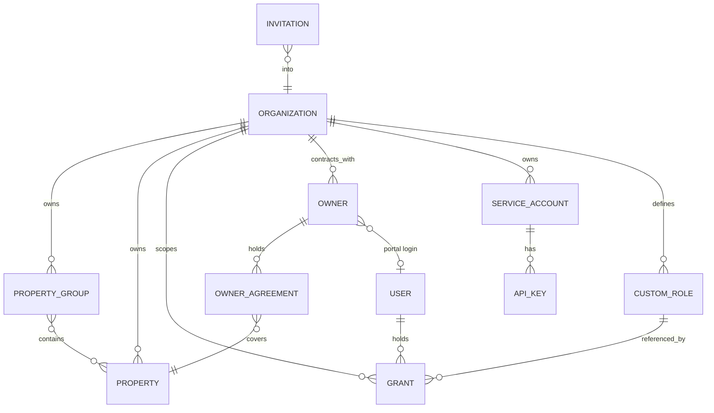
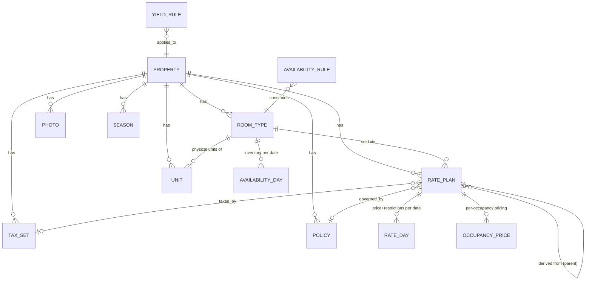
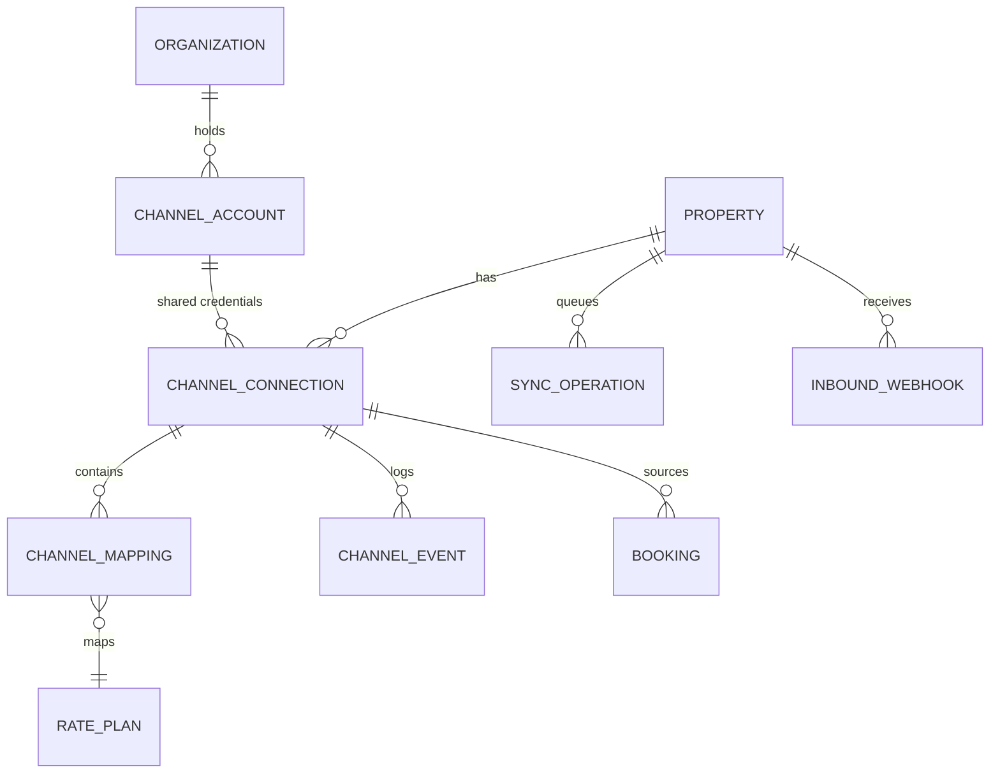
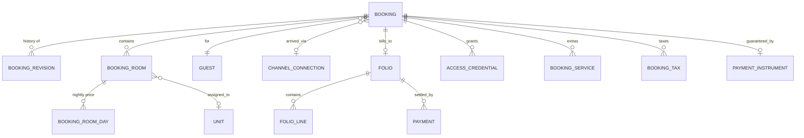
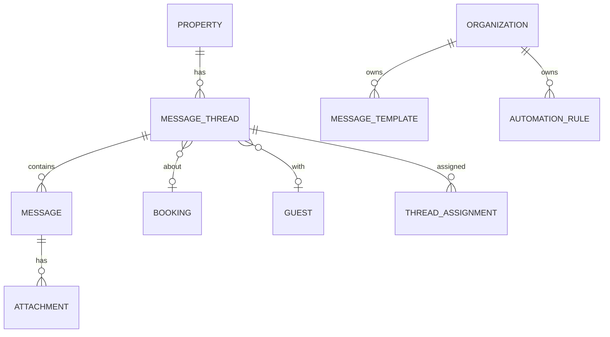
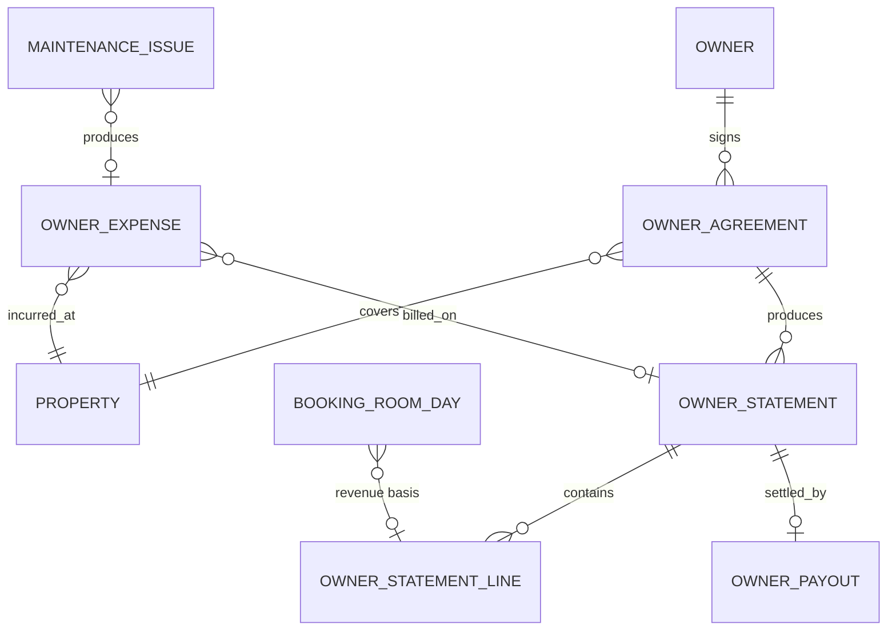

# 03 — Domain Model

**Status:** `review` — revised 2026-08-21 for the short-term-rental segment.

## 3.1 Design rules

1. **We keep our own copy of everything.** Channex IDs are stored as foreign
   references (`channex_id`), never as primary keys. The platform must be readable,
   reportable and auditable when Channex is unreachable.
2. **Our ARI state is authoritative; Channex state is a mirror we verify.** Every
   ARI row carries both a desired value and its last-confirmed synced value
   ([05](./05-channex-integration.md)).
3. **`Property.kind` shapes the UI, never the schema.** One model serves a villa, a
   six-flat building and a 40-room hotel; the *screens* adapt. Forking the schema
   per segment would double every future change.
4. **Physical units are ours alone.** Channex models sellable `room_types`; it has
   no concept of "Apartment 3B" or "room 214". `Unit` is native and never leaves for
   the connectivity layer.
5. **Bookings are append-only.** A `Booking` is a projection of its ordered
   `BookingRevision`s. We never overwrite revision history.
6. **UUIDv7 primary keys** — time-sortable, safe to expose, no cross-tenant
   sequence contention.
7. **Money is integer minor units + ISO-4217 currency.** No floats, ever. We always
   send Channex minor units.
8. **Dates are `date` in property-local time.** A night is a calendar date, not an
   instant. Timestamps are `timestamptz` in UTC.
9. **Soft delete (`archived_at`)** for anything a report or statement may reference;
   hard delete only via the GDPR erasure job.

## 3.2 Tenancy, properties and identity

| Entity | Key fields | Notes |
|---|---|---|
| `Organization` | `name`, `slug`, `country`, `default_currency`, `locale`, `settings`, `channex_account_ref`, `plan_id` | The tenant boundary. Every row is reachable from exactly one org. |
| `PropertyGroup` | `org_id`, `name`, `kind`, `channex_group_id` | Mirrors a Channex group. `kind`: `portfolio` \| `building` \| `city` \| `owner` \| `brand`. A building of six flats and a city cluster are both groups — this is how STR managers actually think, and it is also the RBAC scope. |
| `Property` | `org_id`, `channex_property_id`, `kind`, `title`, `currency`, `timezone`, `address`, `lat/lng`, `settings`, `state`, `content` | **`kind`: `single_unit` \| `multi_unit` \| `hotel`.** `state`: `draft` → `syncing` → `live` → `suspended` → `archived`. |
| `PropertyTemplate` | `org_id`, `name`, `payload` | A saved property/room-type/rate-plan/policy/mapping bundle. **The mechanism that makes listing #40 take three minutes.** |
| `Owner` | `org_id`, `type` (`individual`\|`company`), `name`, `contact`, `tax_id`, `payout_details_ref`, `user_id?`, `locale` | Owners are contacts first; a portal login is optional. Payout bank details are held as a provider token or encrypted reference, never plain. |
| `User` | `email`, `password_hash`, `name`, `locale`, `totp_secret`, `last_login_at` | Global identity; may hold grants across orgs. |
| `Grant` | `subject_type/id`, `role_key`\|`custom_role_id`, `scope_type/id`, `overrides`, `expires_at` | See [02](./02-personas-and-rbac.md). |
| `Invitation` | `email`, `org_id`, `intended_grant`, `token_hash`, `expires_at` | Mirrors Channex's invite-by-email flow. |
| `ServiceAccount` / `ApiKey` | `permissions[]`, `key_hash`, `prefix`, `ip_allowlist`, `last_used_at` | Keys shown once. |

### What `Property.kind` changes

| | `single_unit` | `multi_unit` | `hotel` |
|---|---|---|---|
| Typical | One villa or apartment | A building of 6 flats | A 40-room hotel |
| Room types | Exactly one, `count_of_rooms = 1`, **created and maintained automatically** | One per flat type | Many |
| Units | Exactly one, implicit | One per flat, named | One per room, numbered |
| UI | Room-type layer **hidden entirely** — the property *is* the listing | Unit list visible | Full room-type + room rack |
| Calendar rows | The property itself | Room types, expandable to units | Room types |
| Operations | Turnover + access codes | Turnover + access codes | Front desk + housekeeping |
| Assignment | None (one unit) | Automatic, overridable | Full room assignment |

**MODEL-1** A `single_unit` property's room type and unit are system-managed. The UI
must never ask a manager with 200 villas to create 200 room types by hand — that is
the mistake that makes existing tools unusable at this scale.

## 3.3 Inventory, rates and content

| Entity | Key fields | Notes |
|---|---|---|
| `RoomType` | `channex_room_type_id`, `title`, `count_of_rooms`, `occ_adults/children/infants`, `max_occupancy`, `default_occupancy`, `facilities[]`, `content`, `is_system_managed` | The sellable bucket. `is_system_managed` is true for `single_unit` properties. |
| `Unit` | `room_type_id`, `name`, `floor`, `attributes` (accessible, connecting, pets, view, wifi_name), `access` (lockbox/smart-lock ref), `status`, `owner_agreement_id?` | **Native.** Drives turnover, access codes, and owner attribution. For STR this is where the apartment's real-world detail lives. |
| `RatePlan` | `channex_rate_plan_id`, `room_type_id`, `title`, `currency`, `sell_mode` (`per_room`\|`per_person`), `parent_rate_plan_id`, `derived_option`, `meal_plan`, `tax_set_id`, `policy_id` | Derived plans store their modifier and are *computed*, never hand-edited. |
| `OccupancyPrice` | `rate_plan_id`, `occupancy`, `base_offset` | Supports Channex's multi-occupancy `rates[]` payload. |
| `AvailabilityDay` | `property_id`, `room_type_id`, `date`, `available`, `synced_available`, `sync_state`, `updated_by`, `updated_at` | One row per room type per date. `available` is desired; `synced_available` is what Channex confirmed. |
| `RateDay` | `rate_plan_id`, `date`, `rate`, `rates_by_occupancy`, `min_stay`, `min_stay_arrival`, `min_stay_through`, `max_stay`, `closed_to_arrival`, `closed_to_departure`, `stop_sell`, `synced_*`, `sync_state`, `source` | One row per rate plan per date. `source`: `manual`\|`yield_rule`\|`derived`\|`import`\|`api`. |
| `AvailabilityRule` | `room_type_id`, `type`, `params`, `date_range` | Mirrors the Channex Availability Rules collection: keep-back, cut-off, release. |
| `YieldRule` | `scope`, `priority`, `trigger`, `action`, `guard_rails`, `enabled` | Deterministic, auditable, dry-runnable ([06](./06-inventory-and-rates.md)). |
| `Season` | `name`, `date_ranges[]`, `colour` | Calendar readability and bulk-edit targeting. |
| `TaxSet` / `Tax` | `logic`, `rate`, `applies_to`, `is_inclusive` | Mirrors Channex taxes and tax sets. Tourist tax per jurisdiction lives here. |
| `Policy` | `cancellation_policy`, `deposit`, `check_in/out_times`, `internal_code` | Mirrors the Channex hotel-policy collection. |
| `Photo` | `url`, `position`, `kind`, `room_type_id?`, `channex_photo_id` | Content push where channels support it. |

### Why two ARI tables

Channex separates availability (a property of the **room type** — real, unmodified
inventory) from rates and restrictions (a property of the **rate plan**). We mirror
that split exactly. Collapsing them makes derived rate plans and multi-occupancy
pricing impossible to model later.

**Volume at STR scale:** 200 single-unit properties × 1 room type × 730 days ≈ 146k
availability rows; × 4 rate plans ≈ 584k rate rows. Trivial for Postgres with
`(property_id, date)` range partitioning and a covering index on
`(rate_plan_id, date)`. The pressure at this scale is **not** row count — it is the
number of *provider calls and webhook registrations*, one set per property
([05](./05-channex-integration.md)).

## 3.4 Channels and connectivity

| Entity | Key fields | Notes |
|---|---|---|
| `ChannelAccount` | `org_id`, `adapter_code`, `credentials` (encrypted), `oauth_tokens`, `state` | **New for STR.** An Airbnb or Booking.com account spanning many properties. Connecting 200 listings must not mean entering credentials 200 times. |
| `ChannelConnection` | `property_id`, `channel_account_id?`, `channex_channel_id`, `adapter_code`, `settings`, `state`, `readiness`, `last_error`, `derived_option`, `is_active` | `state`: `draft` → `testing` → `mapped` → `active` → `paused` → `error` → `removed`. |
| `ChannelMapping` | `connection_id`, `rate_plan_id`, `ota_room_code`, `ota_rate_code`, `occupancy`, `rate_type`, `derived_option`, `status` | One row per mapped pair, mirroring the Channex mapping item. |
| `ChannelEvent` | `connection_id`, `type`, `severity`, `payload`, `acknowledged_at` | Feeds the health board from `sync_error`, `rate_error`, `disconnect_channel`, etc. |
| `SyncOperation` | `property_id`, `kind`, `payload_hash`, `date_range`, `state`, `attempts`, `dedupe_key` | The outbound ARI unit of work, coalescable. |
| `InboundWebhook` | `event`, `channex_property_id`, `payload`, `received_at`, `processed_at`, `dedupe_key`, `state` | Persist first, process second. Always. |

## 3.5 Reservations

| Entity | Key fields | Notes |
|---|---|---|
| `Booking` | `property_id`, `channex_booking_id`, `ota_reservation_code`, `channel_connection_id`, `status` (`new`\|`modified`\|`cancelled`), `arrival_date`, `departure_date`, `currency`, `total_amount`, `ota_commission`, `guest_id`, `mapping_state`, `acked_at`, `ops_state` | The current projection. `mapping_state`: `mapped`\|`unmapped_room`\|`unmapped_rate`. |
| `BookingRevision` | `booking_id`, `channex_revision_id`, `system_id`, `revision_type`, `raw_payload` (immutable), `normalised`, `inserted_at`, `acked_at`, `diff_from_previous` | Append-only. `system_id` is Channex's idempotency key. Raw payload retained verbatim for disputes. |
| `BookingRoom` | `booking_id`, `room_type_id?`, `rate_plan_id?`, `checkin_date`, `checkout_date`, `occupancy` (adults/children/infants + `ages[]`), `guest_names`, `amount`, `assigned_unit_id?` | Nullable inventory refs — Channex sends `null` when unmapped. |
| `BookingRoomDay` | `booking_room_id`, `date`, `amount` | The nightly breakdown; the basis for revenue reports **and owner statements**. |
| `Guest` | `property_id`, `name`, `surname`, `email`, `phone`, `country`, `language`, `company` | PII: encrypted, access-logged, erasable. Deduplicated per org by email+phone hash. |
| `AccessCredential` | `booking_id`, `unit_id`, `type` (`door_code`\|`lockbox`\|`smart_lock`\|`key_handover`), `value_encrypted`, `valid_from`, `valid_to`, `issued_at`, `revoked_at`, `provider_ref` | **STR-critical.** Generated per booking, time-boxed, revoked on cancellation, delivered by automated message. Never logged. |
| `PaymentInstrument` | `booking_id`, `type`, `card_type`, `masked_number`, `expiry`, `cardholder`, `vcc_balance`, `vcc_effective_from/to`, `provider_token_ref` | **Never a raw PAN.** Metadata plus a provider token reference. |
| `BookingService` / `BookingTax` | `name`, `amount`, `is_inclusive`, `withheld_by_ota` | Channex distinguishes taxes from *collected* (OTA-withheld) taxes; the flag changes both payout and statement maths. |
| `Folio` / `FolioLine` / `Payment` / `Invoice` | see [08](./08-operations-and-turnover.md) | Native. Channex has no billing concept. |

### Booking projection rule

On each revision: append the revision, recompute the projection, emit a domain
event describing the *diff*. Consumers — availability recalculation, turnover
tasks, access credentials, notifications, statements, reports — subscribe to the
diff. Late or out-of-order revisions are ordered by `(inserted_at, system_id)`; a
stale revision updates history without regressing the projection.

## 3.6 Operations: turnover, cleaning, maintenance

For STR this replaces the front desk. A missed same-day changeover is a one-star
review and a refund.

| Entity | Key fields | Notes |
|---|---|---|
| `Unit.status` | `clean`\|`dirty`\|`in_progress`\|`inspected`\|`out_of_order`\|`out_of_service` | `out_of_order` reduces sellable availability; `out_of_service` does not. |
| `TurnoverTask` | `unit_id`, `date`, `type` (`changeover`\|`departure`\|`mid_stay`\|`deep`\|`inspection`\|`linen`), `window_from/to`, `is_same_day`, `assignee_id?`, `crew_id?`, `state`, `checklist`, `photos[]`, `notes`, `duration_actual` | Generated from booking diffs. `is_same_day` (departure and arrival on one date) drives priority and the hard time window. |
| `Crew` | `org_id`, `name`, `members[]`, `service_area`, `skills` | Cleaners and companies serving many properties. |
| `TaskAssignment` | `task_id`, `assignee_id`, `sequence`, `travel_minutes_estimate`, `accepted_at` | Ordered day route per cleaner — units are spread across a city, not a corridor. |
| `MaintenanceIssue` | `unit_id`, `reported_by`, `severity`, `category`, `description`, `photos[]`, `state`, `blocks_availability`, `vendor_id?`, `cost` | Raised from a turnover; may create a `UnitBlock` and become an owner-billable expense. |
| `UnitBlock` | `unit_id`\|`room_type_id`, `date_range`, `reason` (`maintenance`\|`owner_stay`\|`staff`\|`renovation`), `reduces_availability` | Owner stays are a defining STR case and feed the statement. |
| `Checklist` | `org_id`, `name`, `items[]`, `requires_photo[]` | Per property type; completion is evidence for owners and for disputes. |
| `SupplyItem` / `SupplyCount` | `unit_id`, `item`, `par_level`, `counted` | Linen and consumables. v2. |
| `Note` | `subject_type/id`, `body`, `pinned`, `visibility` | Attachable to booking, guest, unit, property or owner. |

## 3.7 Messaging

| Entity | Key fields | Notes |
|---|---|---|
| `MessageThread` | `channex_thread_id`, `provider` (`booking_com`\|`airbnb`\|`expedia`\|`direct`), `booking_id?`, `guest_id?`, `state` (`open`\|`closed`\|`no_reply_needed`), `unread_count`, `last_message_at`, `first_response_due_at`, `kind` (`booking`\|`inquiry`) | Airbnb inquiries arrive as threads with **no booking** — the model must allow it. |
| `Message` | `thread_id`, `direction`, `author_type` (`guest`\|`staff`\|`system`\|`automation`), `author_id?`, `body`, `sent_at`, `provider_message_id`, `delivery_state`, `template_id?` | `delivery_state`: `queued`\|`sent`\|`failed`. OTA sends do fail. |
| `MessageTemplate` | `name`, `locale`, `channel_scope`, `body`, `category` | **Org-scoped**, not property-scoped: 200 listings cannot each own a copy. Variables resolve per property/unit/booking. |
| `AutomationRule` | `trigger`, `conditions`, `action`, `quiet_hours`, `scope`, `enabled` | Org- or group-scoped, overridable per property ([09](./09-messaging-and-inbox.md)). |
| `Attachment` | `message_id`, `filename`, `mime`, `size`, `storage_key`, `provider_ref` | Mirrored in our object store. |

## 3.8 Owner management

The module no competitor does well, and the reason an STR manager switches.

| Entity | Key fields | Notes |
|---|---|---|
| `OwnerAgreement` | `owner_id`, `property_id`, `unit_ids[]?`, `model` (`commission_pct`\|`fixed_fee`\|`tiered`\|`guaranteed_rent`), `rate`, `commission_basis` (`gross`\|`net_of_ota_commission`\|`net_of_tax`), `deductibles[]`, `payout_schedule`, `payout_day`, `currency`, `vat_treatment`, `effective_from/to`, `document_ref` | `commission_basis` is the field every spreadsheet gets wrong and every dispute is about. It is explicit, versioned, and shown on the statement. |
| `OwnerStatement` | `agreement_id`, `period_from/to`, `state` (`draft`\|`approved`\|`sent`\|`paid`\|`disputed`), `gross_revenue`, `ota_commission`, `withheld_tax`, `management_fee`, `expenses_total`, `adjustments`, `net_due`, `currency`, `pdf_ref`, `approved_by`, `sent_at` | Immutable once `sent`; corrections are credit-note-style adjustments on the next period, never edits. |
| `OwnerStatementLine` | `statement_id`, `kind` (`booking_revenue`\|`ota_commission`\|`management_fee`\|`cleaning`\|`expense`\|`tax`\|`owner_stay`\|`adjustment`), `booking_id?`, `expense_id?`, `date`, `description`, `amount` | Every line traces to a booking night or an expense. No unexplained totals. |
| `OwnerExpense` | `property_id`, `unit_id?`, `date`, `category`, `vendor`, `amount`, `receipt_ref`, `rebillable`, `approved_by`, `statement_id?` | Photographed receipts from the field; approval before it reaches a statement. |
| `OwnerPayout` | `statement_id`, `amount`, `method`, `provider_ref`, `state`, `paid_at`, `failure_reason` | Via a `PayoutProvider` port. Manual/bank-transfer recording is fully supported. |
| `OwnerDocument` | `owner_id`, `kind`, `file_ref`, `expires_at` | Contracts, insurance, tax forms. |

**OWN-1** Statement arithmetic is pure, deterministic and property-based tested. It
is recomputable from source data at any time, and a regenerated draft for the same
period must be byte-identical.
**OWN-2** A cancellation or modification landing after a statement is sent creates
an adjustment line on the next statement, with a link to the original.
**OWN-3** Owners see their own properties only, ever, enforced by scope and proven
by test.

## 3.9 Reviews, insight and platform

| Entity | Notes |
|---|---|
| `Review` / `ReviewResponse` | Mirrors the Channex reviews collection; responds where the OTA allows. |
| `AuditLog` | `org_id`, `actor`, `action`, `subject`, `before`, `after`, `surface`, `ip`, `request_id`, `occurred_at`. Append-only, hash-chained per org. |
| `OutboxEvent` | Transactional outbox: domain events written in the same transaction as the state change, then published. How "no silently lost booking" is guaranteed. |
| `Notification` / `NotificationPreference` | Per user, per channel (in-app, email, push, Slack/webhook), with digests and severity routing. |
| `Report` / `SavedView` / `ScheduledExport` | User-defined dashboards and reports. |
| `PluginInstallation` | `plugin_id`, `version`, `scope`, `config`, `granted_permissions[]`, `state`. |
| `Plan` / `Subscription` / `UsageRecord` | Billing, in v1 ([12](./12-platform-admin-and-billing.md)). |

## 3.10 Invariants

Each gets a database constraint where possible, and an integration test always.

- **INV-1** Every `Property` belongs to exactly one `Organization` and at least one
  `PropertyGroup` (Channex requires group membership).
- **INV-2** `AvailabilityDay.available` ≥ 0 and ≤ `RoomType.count_of_rooms` minus
  blocking `UnitBlock`s for that date.
- **INV-3** Unique `(room_type_id, date)` on `AvailabilityDay`; unique
  `(rate_plan_id, date)` on `RateDay`.
- **INV-4** `BookingRevision.system_id` is globally unique — the duplicate-delivery
  guard.
- **INV-5** A `Booking` has ≥1 `BookingRoom`, and `arrival_date` < `departure_date`
  unless it is a same-day cancellation.
- **INV-6** A derived `RatePlan` cannot be its own ancestor; derivation depth ≤ 3.
- **INV-7** No `PaymentInstrument` or `AccessCredential` row may contain a
  PAN-shaped value — enforced by a check constraint *and* a pre-commit scanner.
- **INV-8** `ChannelMapping` may not reference a `RatePlan` from a different
  property than its connection.
- **INV-9** Deleting a `RoomType` or `RatePlan` referenced by an active
  `ChannelMapping` is refused; unmap first.
- **INV-10** Every tenant-data table has a non-null `org_id` (or a parent chain to
  one) and is protected by row-level security.
- **INV-11** A `single_unit` property has exactly one `RoomType`
  (`count_of_rooms = 1`) and exactly one `Unit`, both system-managed.
- **INV-12** Overlapping `OwnerAgreement`s for the same property and date range are
  refused — otherwise a booking night could be paid out twice.
- **INV-13** A `sent` `OwnerStatement` is immutable; its lines may not be inserted,
  updated or deleted.
- **INV-14** An `AccessCredential` is revoked whenever its booking is cancelled or
  its dates move, within one minute of the revision applying.
