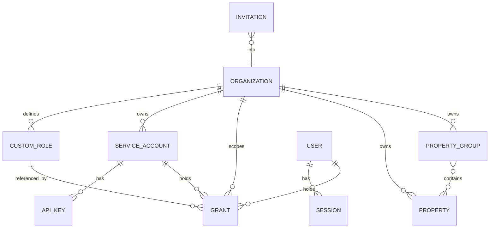
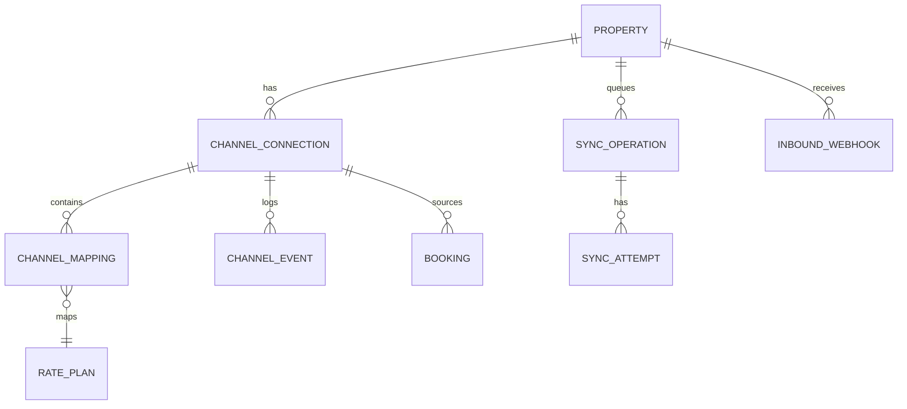
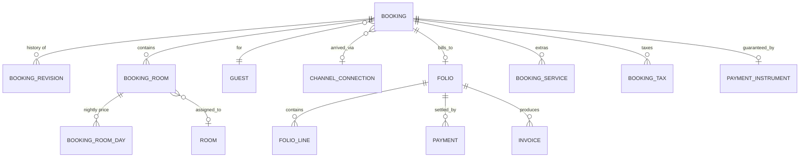
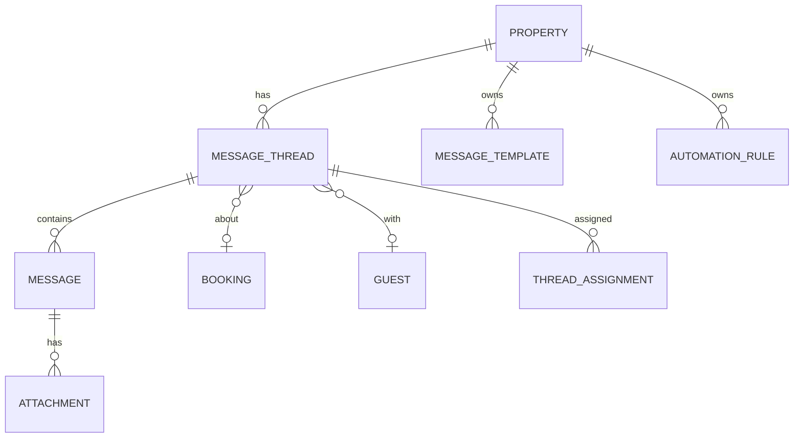

# 03 — Domain Model

**Status:** `draft`

## 3.1 Design rules

1. **We keep our own copy of everything.** Channex IDs are stored as foreign
   references (`channex_id`), never as primary keys. The platform must be
   readable, reportable and auditable when Channex is unreachable.
2. **Our ARI state is authoritative; Channex state is a mirror we verify.** Every
   ARI row therefore carries both a desired value and its last-confirmed
   synchronised value ([05](./05-channex-integration.md)).
3. **Physical rooms are ours alone.** Channex models sellable `room_types`;
   Channex has no concept of "room 214". A PMS does. `Room` is native and never
   leaves for the connectivity layer.
4. **Bookings are append-only.** A `Booking` is a projection of its ordered
   `BookingRevision`s. We never overwrite revision history.
5. **UUIDv7 primary keys** everywhere — time-sortable, safe to expose, no
   sequence contention across tenants.
6. **Money is integer minor units + ISO-4217 currency.** No floats, ever. Channex
   accepts both decimal strings and minor-unit integers; we always send minor
   units.
7. **Dates are `date` in property-local time.** A hotel night is a calendar date,
   not an instant. Timestamps are `timestamptz` in UTC.
8. **Soft delete (`archived_at`) for anything a report may reference**; hard
   delete only via a GDPR erasure job ([13](./13-nfr-security-compliance.md)).

## 3.2 Tenancy and identity

| Entity | Key fields | Notes |
|---|---|---|
| `Organization` | `name`, `slug`, `country`, `default_currency`, `locale`, `settings`, `channex_account_ref`, `plan_id` | The tenant boundary. Every row in the system is reachable from exactly one org. |
| `PropertyGroup` | `org_id`, `name`, `channex_group_id` | Mirrors a Channex group. Channex requires every property to belong to ≥1 group, so we always create one — a single-property install gets a default group transparently. |
| `Property` | `org_id`, `channex_property_id`, `title`, `currency`, `timezone`, `address`, `lat/lng`, `settings`, `state` | `state`: `draft` → `syncing` → `live` → `suspended` → `archived`. |
| `User` | `email`, `password_hash`, `name`, `locale`, `totp_secret`, `last_login_at` | Global identity; may hold grants in several orgs. |
| `Grant` | `subject_type`, `subject_id`, `role_key` \| `custom_role_id`, `scope_type`, `scope_id`, `overrides`, `expires_at`, `created_by` | See [02](./02-personas-and-rbac.md). |
| `Invitation` | `email`, `org_id`, `intended_grant`, `token_hash`, `expires_at`, `accepted_at` | Mirrors Channex's invite-by-email flow; we auto-create the user on acceptance. |
| `ServiceAccount` / `ApiKey` | `permissions[]`, `key_hash`, `prefix`, `ip_allowlist`, `last_used_at`, `rotated_at` | Keys are shown once. |

## 3.3 Inventory, rates and content

| Entity | Key fields | Notes |
|---|---|---|
| `RoomType` | `channex_room_type_id`, `title`, `count_of_rooms`, `occ_adults`, `occ_children`, `occ_infants`, `max_occupancy`, `default_occupancy`, `facilities[]`, `content` | The sellable bucket. `count_of_rooms` is the physical ceiling for availability. |
| `Room` | `room_type_id`, `number`, `floor`, `attributes` (accessible, connecting, view), `status` | **Native.** Drives room assignment and housekeeping. Count MAY be less than `count_of_rooms` during onboarding; a warning surfaces when they disagree. |
| `RatePlan` | `channex_rate_plan_id`, `room_type_id`, `title`, `currency`, `sell_mode` (`per_room`\|`per_person`), `rate_mode`, `parent_rate_plan_id`, `derived_option`, `meal_plan`, `tax_set_id`, `policy_id`, `auto_rate_settings` | Derived plans store their modifier (`percent`/`amount`, `increase`/`decrease`) and are *computed*, never hand-edited. |
| `OccupancyPrice` | `rate_plan_id`, `occupancy`, `base_offset` | Supports Channex's multi-occupancy `rates[]` payload. |
| `AvailabilityDay` | `property_id`, `room_type_id`, `date`, `available`, `physical_blocked`, `synced_available`, `sync_state`, `updated_by`, `updated_at` | One row per room type per date. `available` is desired; `synced_available` is what Channex last confirmed. |
| `RateDay` | `rate_plan_id`, `date`, `rate` (minor units), `rates_by_occupancy`, `min_stay`, `min_stay_arrival`, `min_stay_through`, `max_stay`, `closed_to_arrival`, `closed_to_departure`, `stop_sell`, `synced_*`, `sync_state`, `source` | One row per rate plan per date. `source`: `manual` \| `yield_rule` \| `derived` \| `import` \| `api`. |
| `AvailabilityRule` | `room_type_id`, `type`, `params`, `date_range` | Mirrors the Channex Availability Rules collection (e.g. keep-N-back, cut-off). |
| `YieldRule` | `property_id`, `scope`, `priority`, `trigger` (occupancy %, days-to-arrival, day-of-week, pace), `action` (adjust rate/restriction), `guard_rails` (floor/ceiling), `enabled` | Deterministic, auditable, dry-runnable. See [06](./06-inventory-and-rates.md). |
| `Season` | `name`, `date_ranges[]`, `colour` | Purely for calendar readability and bulk-edit targeting. |
| `TaxSet` / `Tax` | `logic`, `rate`, `applies_to`, `is_inclusive`, `currency` | Mirrors Channex taxes and tax sets. |
| `Policy` | `cancellation_policy`, `deposit`, `check_in/out_times`, `internal_code` | Mirrors the Channex hotel-policy collection. |
| `Photo` | `url`, `position`, `kind`, `room_type_id?`, `channex_photo_id` | Content push to OTAs where supported. |

### Why two ARI tables

Channex separates availability (a property of the **room type** — real, unmodified
inventory) from rates and restrictions (a property of the **rate plan**). We mirror
that split exactly. Collapsing them into one wide table is the classic mistake that
makes derived rate plans and multi-occupancy pricing impossible to model later.

**Volume sanity check:** 20 room types × 700 days ≈ 14k availability rows per
property; 60 rate plans × 700 days ≈ 42k rate rows. A 200-property portfolio is
~11M rows — trivial for Postgres with `(property_id, date)` range partitioning and
a covering index on `(rate_plan_id, date)`.

## 3.4 Channels and connectivity

| Entity | Key fields | Notes |
|---|---|---|
| `ChannelConnection` | `property_id`, `channex_channel_id`, `adapter_code`, `title`, `settings` (secrets encrypted), `state`, `readiness`, `last_error`, `derived_option`, `is_active` | `state`: `draft` → `testing` → `mapped` → `active` → `paused` → `error` → `removed`. |
| `ChannelMapping` | `connection_id`, `rate_plan_id`, `ota_room_code`, `ota_rate_code`, `occupancy`, `rate_type`, `derived_option`, `status` | One row per mapped pair, mirroring the Channex mapping item. |
| `ChannelEvent` | `connection_id`, `type`, `severity`, `payload`, `acknowledged_at` | Feeds the channel health board from `sync_error`, `rate_error`, `disconnect_channel`, `channel_removal_warning`, etc. |
| `SyncOperation` | `property_id`, `kind` (`availability`\|`restrictions`\|`content`\|`mapping`), `payload_hash`, `date_range`, `state`, `attempts`, `dedupe_key`, `enqueued_at`, `completed_at` | The outbound ARI unit of work. Coalescable — see [05](./05-channex-integration.md). |
| `InboundWebhook` | `event`, `channex_property_id`, `payload`, `received_at`, `processed_at`, `dedupe_key`, `state`, `error` | Persist first, process second. Always. |

## 3.5 Reservations

| Entity | Key fields | Notes |
|---|---|---|
| `Booking` | `property_id`, `channex_booking_id`, `ota_reservation_code`, `channel_connection_id`, `status` (`new`\|`modified`\|`cancelled`), `arrival_date`, `departure_date`, `currency`, `total_amount`, `ota_commission`, `guest_id`, `mapping_state`, `acked_at`, `pms_state` | The current projection. `mapping_state`: `mapped` \| `unmapped_room` \| `unmapped_rate` — drives the resolution queue. |
| `BookingRevision` | `booking_id`, `channex_revision_id`, `system_id`, `revision_type`, `raw_payload` (immutable), `normalised`, `inserted_at`, `acked_at`, `diff_from_previous` | Append-only. `system_id` is the idempotency key from Channex. `raw_payload` is retained verbatim for dispute resolution. |
| `BookingRoom` | `booking_id`, `room_type_id?`, `rate_plan_id?`, `checkin_date`, `checkout_date`, `occupancy` (adults/children/infant + `ages[]`), `guest_names`, `amount`, `assigned_room_id?` | Nullable inventory refs: Channex sends `null` when unmapped. |
| `BookingRoomDay` | `booking_room_id`, `date`, `amount` | The per-night breakdown Channex provides; the basis for revenue reports. |
| `Guest` | `property_id`, `name`, `surname`, `email`, `phone`, `country`, `language`, `company`, `masked_flags` | PII. Encrypted at rest, access-logged, erasable. Deduplicated per property by email+phone hash. |
| `PaymentInstrument` | `booking_id`, `type` (`masked_card`\|`virtual_card`\|`token`), `card_type`, `masked_number`, `expiry`, `cardholder`, `vcc_balance`, `vcc_effective_from/to`, `provider_token_ref` | **Never a raw PAN.** Metadata only, plus a token reference held by Stripe or a Channex payment app. |
| `BookingService` / `BookingTax` | `name`, `amount`, `is_inclusive`, `withheld_by_ota` | Channex distinguishes taxes from *collected* (OTA-withheld) taxes; we keep the flag because it changes the payout maths. |
| `Folio` / `FolioLine` / `Payment` / `Invoice` | see [08](./08-reservations-and-frontdesk.md) | Native. Channex has no billing concept. |

### Booking projection rule

On each revision: append the revision, recompute the projection, emit a domain
event describing the *diff* (not the whole booking). Consumers — availability
recalculation, notifications, messaging, reports — subscribe to the diff. Late or
out-of-order revisions are ordered by `(inserted_at, system_id)`, and a revision
older than the current projection updates history without regressing the
projection.

## 3.6 Front desk and housekeeping

| Entity | Key fields | Notes |
|---|---|---|
| `Room` | (see §3.3) `status`: `clean`\|`dirty`\|`inspected`\|`out_of_order`\|`out_of_service` | `out_of_order` reduces sellable availability; `out_of_service` does not. |
| `HousekeepingTask` | `room_id`, `date`, `type` (`departure`\|`stayover`\|`deep`\|`turndown`), `assignee_id`, `state`, `notes`, `photos[]` | Generated nightly from arrivals/departures/stayovers. |
| `RoomBlock` | `room_id` \| `room_type_id`, `date_range`, `reason`, `reduces_availability` | Maintenance, owner stays, staff use. |
| `Note` | `subject_type/id`, `body`, `pinned`, `visibility` (`internal`\|`shift`) | Attachable to booking, guest, room, or property. |

## 3.7 Messaging

| Entity | Key fields | Notes |
|---|---|---|
| `MessageThread` | `channex_thread_id`, `provider` (`booking_com`\|`airbnb`\|`expedia`\|`direct`), `booking_id?`, `guest_id?`, `state` (`open`\|`closed`\|`no_reply_needed`), `unread_count`, `last_message_at`, `first_response_due_at`, `kind` (`booking`\|`inquiry`) | Airbnb inquiries arrive as threads with **no booking** — the model must allow that. |
| `Message` | `thread_id`, `direction` (`inbound`\|`outbound`), `author_type` (`guest`\|`staff`\|`system`\|`automation`), `author_id?`, `body`, `sent_at`, `provider_message_id`, `delivery_state`, `template_id?` | `delivery_state` covers `queued`\|`sent`\|`failed` — OTA sends can and do fail. |
| `Attachment` | `message_id`, `filename`, `mime`, `size`, `storage_key`, `provider_ref` | Uploaded to the provider, mirrored in our object store. |
| `MessageTemplate` | `name`, `locale`, `channel_scope`, `body` (variables), `category` | Variable interpolation from booking/guest context. |
| `AutomationRule` | `trigger` (booking created, T-3 days, post-checkout, inquiry received), `conditions`, `action` (send template, assign, tag), `quiet_hours`, `enabled` | See [09](./09-messaging-and-inbox.md). |

## 3.8 Reviews, insight and platform

| Entity | Notes |
|---|---|
| `Review` / `ReviewResponse` | Mirrors the Channex reviews collection; `respond` pushes back where the OTA allows it. |
| `AuditLog` | `org_id`, `actor` (user/service/automation/impersonator), `action`, `subject`, `before`, `after`, `surface` (`ui`\|`api`\|`automation`\|`import`), `ip`, `request_id`, `occurred_at`. Append-only, tamper-evident (hash chain per org). |
| `OutboxEvent` | Transactional outbox: domain events written in the same transaction as the state change, then published. This is how we guarantee "no silently lost booking". |
| `Notification` / `NotificationPreference` | Per user, per channel (in-app, email, push, Slack/webhook), with digest and severity routing. |
| `Report` / `SavedView` / `ScheduledExport` | User-defined dashboard and report configuration. |
| `PluginInstallation` | `plugin_id`, `version`, `scope`, `config`, `granted_permissions[]`, `state`. |
| `Plan` / `Subscription` / `UsageRecord` | SaaS mode only ([12](./12-platform-admin-and-billing.md)). |

## 3.9 Invariants

Each of these gets a database constraint where possible and an integration test always.

- **INV-1** Every `Property` belongs to exactly one `Organization` and at least
  one `PropertyGroup` (Channex requires group membership).
- **INV-2** `AvailabilityDay.available` ≥ 0 and ≤ `RoomType.count_of_rooms` minus
  blocking `RoomBlock`s for that date.
- **INV-3** Unique `(room_type_id, date)` on `AvailabilityDay`; unique
  `(rate_plan_id, date)` on `RateDay`.
- **INV-4** `BookingRevision.system_id` is globally unique — this is the
  duplicate-delivery guard.
- **INV-5** A `Booking` always has ≥1 `BookingRoom`, and `arrival_date` <
  `departure_date` unless it is a same-day cancellation.
- **INV-6** A derived `RatePlan` cannot be its own ancestor (no cycles), and
  derivation depth is capped at 3.
- **INV-7** No `PaymentInstrument` row may contain a value matching a PAN regex —
  enforced by a check constraint *and* a pre-commit scanner.
- **INV-8** `ChannelMapping` may not reference a `RatePlan` from a different
  property than its connection.
- **INV-9** Deleting a `RoomType` or `RatePlan` referenced by an active
  `ChannelMapping` is refused; it must be unmapped first.
- **INV-10** Every table carrying tenant data has a non-null `org_id` (or a
  parent chain to one) and is protected by row-level security.
