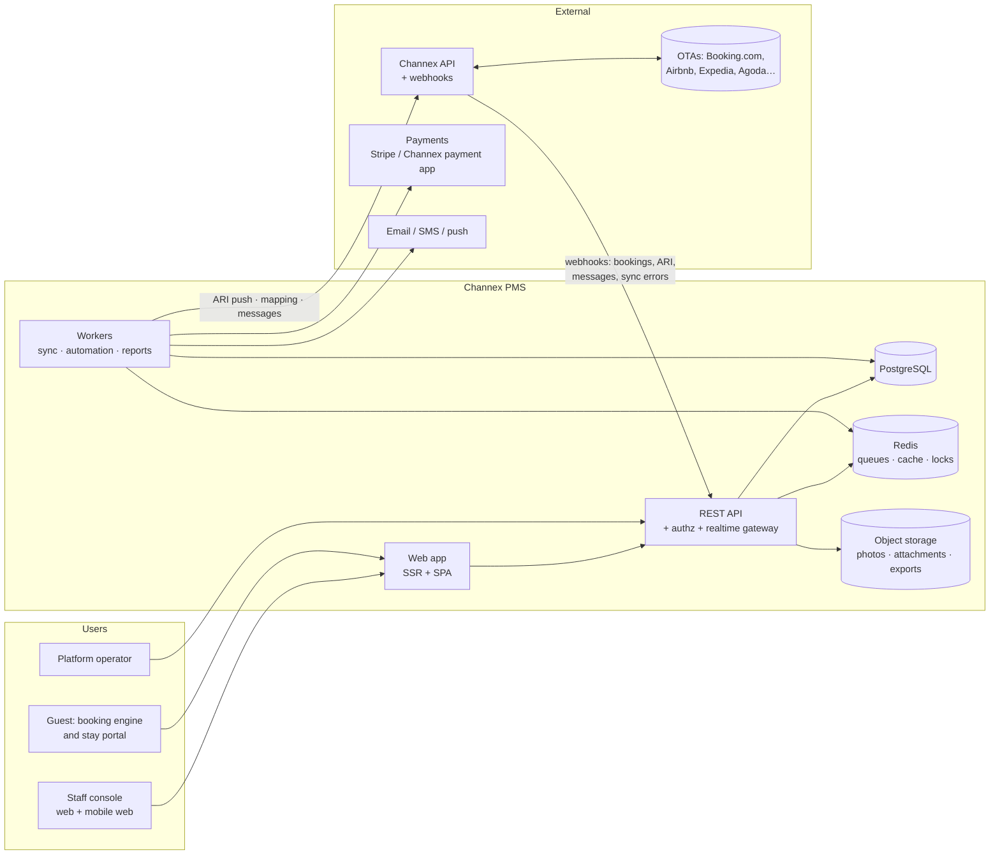
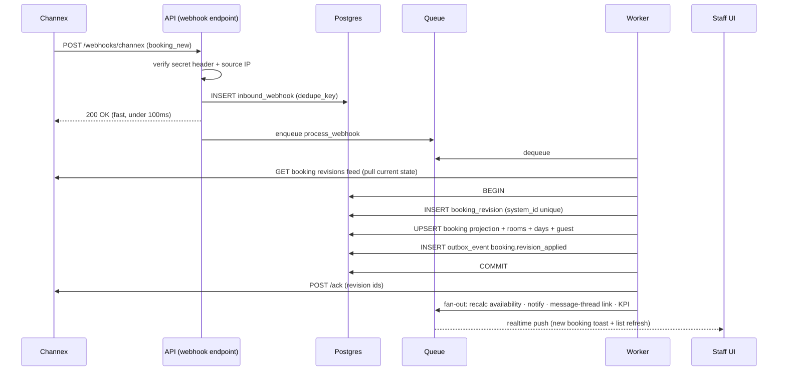
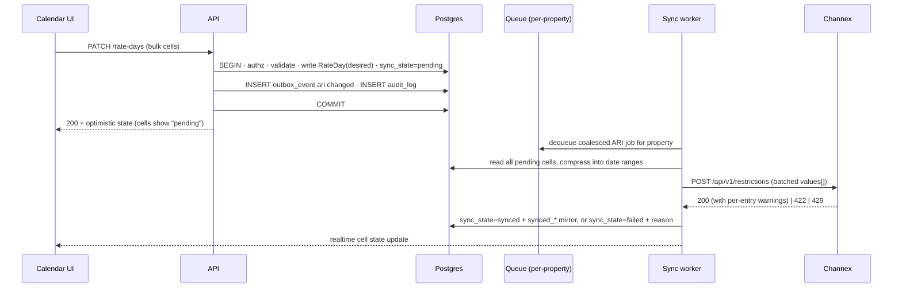

# 04 — Architecture

**Status:** `review` — revised 2026-08-21 to match the D3 stack decision (full-stack Next.js + worker; no separate api app in v1) and the owners/operations modules.

## 4.1 System context



## 4.2 Shape: modular monolith + workers

**Decision (ADR-0001): one deployable API application organised into strict
modules, plus a separate worker process. Not microservices.**

Why: the hard problems here are correctness (never lose a booking, never let ARI
drift) and contributor throughput, not independent scaling of thirty services. A
single Postgres transaction spanning "persist revision, recompute projection,
enqueue availability recalculation" removes an entire class of distributed bugs
that a small OSS team cannot afford to chase.

Modules — each owns its tables, exposes a typed service interface, and may not
import another module's internals:

| Module | Owns |
|---|---|
| `identity` | users, orgs, groups, grants, sessions, SSO |
| `authz` | permission catalogue, evaluation, policy tests |
| `properties` | property, content, policies, taxes, photos, rooms |
| `inventory` | room types, rate plans, availability, rates, restrictions, yield rules |
| `channels` | connections, adapter descriptors, mappings, health |
| `connectivity` | the provider port + Channex adapter + sync engine |
| `reservations` | bookings, revisions, projections, unmapped queue |
| `operations` | turnover tasks, crews, cleaner app, maintenance, blocks, access credentials; front-desk surfaces for hotel-kind |
| `billing_ops` | folios, charges, payments, invoices *(guest-facing money)* |
| `owners` | owners, agreements, statements, expenses, payouts, owner portal |
| `messaging` | threads, messages, templates, automation |
| `reviews` | reviews, responses |
| `insight` | reports, KPI aggregates, exports, saved views |
| `notifications` | preferences, delivery, digests |
| `audit` | append-only log, hash chain |
| `platform` | plans, subscriptions, quotas, operator console *(hosted service; v1)* |
| `plugins` | registry, installation, sandboxed execution |

Cross-module communication is **either** a direct typed call within a request
transaction **or** a domain event via the outbox — never a shared table read.

The escape hatch is deliberate: because modules communicate over interfaces and
events, any one of them can be extracted into its own service later without
rewriting callers. We just refuse to pay that cost on day one.

## 4.3 Ports and adapters

Domain code depends on interfaces; infrastructure implements them.

```ts
interface ConnectivityProvider {
  // provisioning
  ensureGroup(g: GroupSpec): Promise<ProviderRef>
  ensureProperty(p: PropertySpec): Promise<ProviderRef>
  ensureRoomType(rt: RoomTypeSpec): Promise<ProviderRef>
  ensureRatePlan(rp: RatePlanSpec): Promise<ProviderRef>

  // ARI
  pushAvailability(batch: AvailabilityBatch): Promise<PushResult>
  pushRatesAndRestrictions(batch: RestrictionBatch): Promise<PushResult>
  readAri(query: AriQuery): Promise<AriSnapshot>       // for drift detection

  // channels
  getAdapterDescriptor(code: string): Promise<AdapterDescriptor>
  testConnection(s: ConnectionSettings): Promise<TestResult>
  readChannelMappingOptions(s: ConnectionSettings): Promise<MappingOptions>
  createChannel(c: ChannelSpec): Promise<ProviderRef>
  checkReadiness(ref: ProviderRef): Promise<Readiness>
  setChannelActive(ref: ProviderRef, active: boolean): Promise<void>

  // reservations
  listBookingRevisions(cursor?: string): Promise<BookingRevisionPage>
  ackBookingRevisions(ids: string[]): Promise<void>
  getBooking(ref: ProviderRef): Promise<BookingPayload>

  // messaging + reviews
  listThreads(q: ThreadQuery): Promise<ThreadPage>
  sendMessage(m: OutboundMessage): Promise<ProviderRef>
  uploadAttachment(a: AttachmentUpload): Promise<ProviderRef>
  closeThread(ref: ProviderRef, reason: CloseReason): Promise<void>
  listReviews(q: ReviewQuery): Promise<ReviewPage>
  respondToReview(ref: ProviderRef, body: string): Promise<void>
}
```

Also ported: `PaymentProvider`, `NotificationTransport`, `ObjectStorage`,
`SearchIndex`, `GeoLookup`.

Three implementations of `ConnectivityProvider` ship in-repo:

1. **`ChannexProvider`** — production.
2. **`ChannexStagingProvider`** — same code, `staging.channex.io`, used for the
   PMS certification tests.
3. **`FakeProvider`** — an in-memory simulator that models the behaviours that
   actually break us: `429`s, out-of-order webhooks, duplicate revisions,
   partially-valid ARI batches, unmapped bookings, thread assignment races. The
   entire test suite and the demo seed run against it, so contributors need no
   Channex account to work on the platform.

## 4.4 Request and event flows

### Inbound: an OTA booking



Non-negotiables in this flow:

- **Acknowledge the HTTP request before doing work.** A slow webhook handler
  causes retries and duplicates.
- **Persist the raw payload before parsing it.** A parse bug must never lose data.
- **Treat the webhook as a trigger, not as truth** — Channex documents that
  webhooks can arrive out of order, so we always pull current state.
- **Ack only after the transaction commits.** Channex stops re-serving an
  acknowledged revision; acking early is how bookings vanish.

### Outbound: a rate change



## 4.5 Queues

Redis-backed (BullMQ), all jobs idempotent, all with a `dedupe_key`.

| Queue | Concurrency | Notes |
|---|---|---|
| `webhook.ingest` | high | Tiny, fast, never calls Channex synchronously. |
| `ari.push` | **1 per property** | Serialised per property so pushes cannot race. Coalescing window 2–5 s. |
| `booking.process` | medium | Revision application + ack. |
| `booking.ack_sweep` | 1 | Safety net: re-ack anything unacked after 5 min. |
| `messages.sync` | medium | Thread/message pull, send retries. |
| `automation.run` | medium | Scheduled guest messaging, yield rules. |
| `reconcile.ari` | low | Nightly drift detection per property. |
| `reports.build` | low | Aggregate rollups, scheduled exports. |
| `notify.deliver` | high | Email/push/webhook fan-out. |
| `dlq.*` | — | Dead letters, operator-visible and replayable from the UI. |

**Priority rule:** anything that can lose money (booking ingest, ack, ARI push)
outranks anything cosmetic (reports, thumbnails). Under saturation we shed
report jobs, never sync jobs.

## 4.6 Multi-tenancy enforcement

Defence in depth, because a cross-tenant leak is the one bug that ends the project:

1. **Postgres row-level security** on every tenant table, keyed on `org_id` from a
   session variable set per transaction.
2. **A repository layer** that refuses to build a query without a tenant context.
3. **A CI test** that enumerates routes and asserts each rejects a foreign-tenant
   ID with `403`/`404`.
4. **Object storage keys** prefixed `org/{org_id}/…` with signed, short-lived URLs.
5. **Per-tenant encryption keys** for the PII and credentials columns.

## 4.7 API surface

- **REST, versioned by path** (`/v1/…`), JSON, `application/problem+json` errors.
  We choose REST over GraphQL: it caches, it is trivial to consume from a shell
  script, and it keeps authorisation checks on obvious boundaries.
- **Cursor pagination** everywhere (`?cursor=&limit=`, max 200).
- **Idempotency:** all unsafe endpoints accept `Idempotency-Key`.
- **Optimistic concurrency:** `ETag`/`If-Match` on entities; ARI cell writes carry
  a client-side `expected_version` so two revenue managers editing the same
  weekend get a conflict, not a silent overwrite.
- **Our own outbound webhooks** so third parties can build on us, with the
  signing we wish we had received: `X-Signature: sha256=…` HMAC over the raw
  body, plus timestamp and replay window.
- **OpenAPI 3.1 generated from code**, published, and used to generate the TS
  client the web app itself consumes. Dogfooding keeps it honest.
- **Realtime:** WebSocket (SSE fallback) channels scoped
  `org:{id}:property:{id}:{topic}` for calendar cells, inbox, booking feed,
  sync/channel health.

## 4.8 Deployment topology

| Target | Contents |
|---|---|
| **Docker Compose** (default, self-host) | `web`, `worker`, `migrate`, `postgres`, `redis`, `minio`, `caddy` (ADR-0002: no separate `api` app). One `.env`, one command, seedable demo data. |
| **Helm chart** (portfolio / SaaS) | Separately scaled `web` and `worker` deployments, HPA, managed Postgres/Redis/S3, external secrets. |
| **Single-container demo** | For evaluation only; SQLite is explicitly *not* supported — the ARI model needs Postgres. |

Configuration is environment variables only (12-factor), validated at boot with a
schema; the process refuses to start on invalid config rather than failing at 3am.
Migrations run as an explicit job, never implicitly on boot.

## 4.9 Observability

- **OpenTelemetry** traces across HTTP → queue → provider call. A trace ID is
  shown in the UI on every error so a hotelier can paste it into an issue.
- **Metrics that matter** (all labelled by property):
  `ari_push_latency_seconds`, `ari_cells_pending`, `ari_drift_cells`,
  `booking_ingest_lag_seconds`, `booking_unacked_count`,
  `webhook_processing_failures`, `channel_state`, `message_first_response_seconds`,
  `queue_depth`, `provider_429_total`, `provider_error_total`.
- **SLOs:** ARI push p95 < 60 s · booking visible in UI p95 < 30 s from webhook ·
  unacked revisions older than 10 min = 0 · webhook endpoint availability 99.9%.
- **Alerts** route to the operator console *and* the affected tenant when the
  cause is tenant-side (expired OTA credentials, a channel disconnected by the
  OTA, mapping gaps).
- **Structured logs** with `request_id`, `org_id`, `property_id`, `actor`. PII is
  never logged; a CI check greps for known-sensitive field names in log calls.

## 4.10 Repository layout

```
apps/
  web/            Next.js — staff console, booking engine, guest portal,
                  owner portal, webhook receiver, public REST API v1
  worker/         queue consumers, schedulers, realtime gateway
packages/
  core/           domain entities, value objects, money, dates
  authz/          permission catalogue + evaluator (generated from spec 02)
  db/             schema, migrations, repositories, RLS policies
  connectivity/   provider port + channex adapter + fake provider
  sync/           ARI diffing, coalescing, drift detection
  ui/             design system, calendar grid, data table
  sdk/            generated public API client (Apache-2.0)
  testkit/        fixtures, property-based generators, scenario runner
docs/
  specs/          this directory
  adr/            architecture decision records
  runbooks/       operator procedures (see spec 12)
```

## 4.11 Testing strategy

| Layer | Approach |
|---|---|
| Domain | Unit tests; **property-based tests** for ARI diffing, date-range compression, derived-rate computation and money maths. These are where the subtle bugs live. |
| Authz | A generated matrix test: every (role × permission × scope) combination asserted against spec 02. |
| Integration | Real Postgres + Redis in containers; `FakeProvider` for connectivity. |
| Contract | Recorded fixtures of real Channex responses, replayed; a scheduled job runs the live suite against `staging.channex.io` to catch upstream drift. |
| Chaos | Scenario runner injects duplicate webhooks, out-of-order revisions, `429` storms, mid-batch `422`s, and provider outages. Asserted invariant: **no booking lost, no ARI cell permanently wrong**. |
| E2E | Playwright over the critical journeys: onboard property → map channel → change rate → receive booking → message guest → check in. |
| Certification | The Channex PMS certification tests are a first-class CI target before any production release. |
