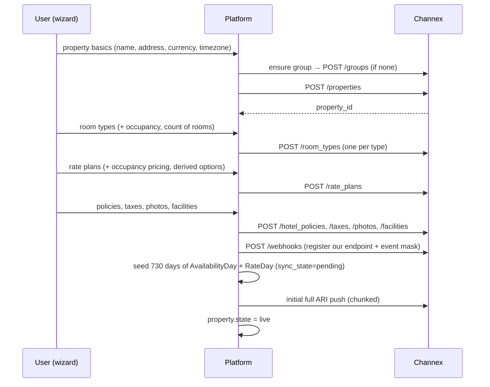
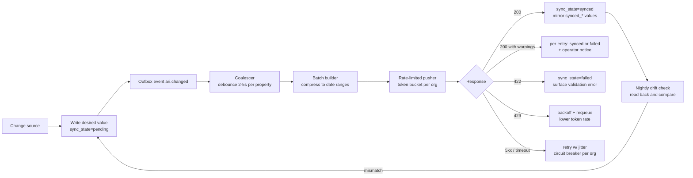
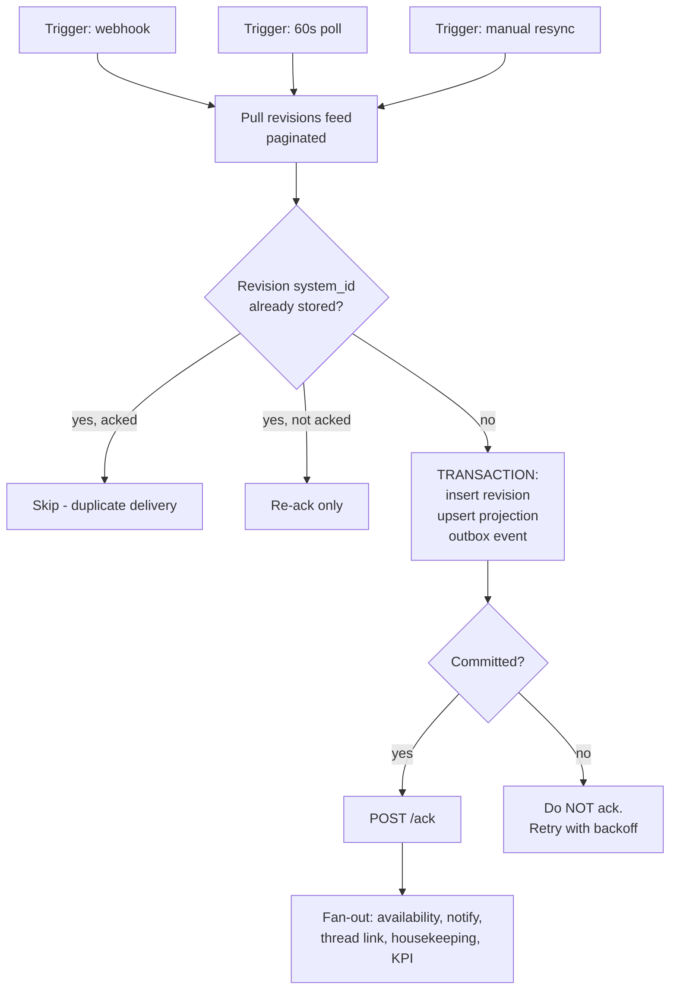

# 05 — Channex Integration & Sync Engine

**Status:** `accepted` (2026-09-02) — sync engine, webhook receiver, ingestion and ack loop implemented in M1 against `FakeProvider` and docs-sourced fixtures; the certification suite (§5.11) ran against staging.channex.io on 2026-09-02 (provisioning, PROV-3 idempotency, ARI round trip, property import, adapter descriptor) and its recorded fixtures live in `packages/connectivity/fixtures/recorded/`. Staging corrections: property address fields are flat (`address`, `city`, `zip_code`, `country`), a plain `min_stay` is refused by default (sent as `min_stay_arrival` + `min_stay_through`), webhook callback hosts must resolve, and adapter descriptors carry their fields in `data.params`. §5.8 IDs renamed `CXMSG-n`.

This is the spec that decides whether the platform is trustworthy. Everything
here exists to satisfy two promises from [01](./01-vision-and-scope.md): *never
silently lose a booking*, and *never let inventory drift without saying so*.

## 5.1 What Channex provides, and where it lands

| Channex collection | Our module | Direction |
|---|---|---|
| Properties, Groups, Property/Group Users | `properties`, `identity` | push (we provision), pull on reconcile |
| Room Types, Rate Plans | `inventory` | push |
| Availability and Rates (ARI), Availability Rules | `inventory` + `sync` | push, pull for drift check |
| Bookings (+ revisions feed, `/ack`) | `reservations` | pull |
| Webhooks | `connectivity` | inbound |
| Channel API (adapters, mapping, activate) | `channels` | both |
| Messages | `messaging` | both |
| Reviews | `reviews` | pull + respond |
| Photos, Hotel Policy, Facilities, Taxes/Tax Sets | `properties` | push |
| Applications API, Payment Application, Stripe tokenisation | `billing_ops` | both |
| Booking CRS API, Open Channel API, Shopping API | `booking_engine` (later) | both |
| Channel IFrame | `channels` (fallback UI) | embed |

**Base URLs:** production `https://channex.io`, sandbox
`https://staging.channex.io`. **Auth:** the `user-api-key` header.
**Pagination:** `pagination[page]` / `pagination[limit]`, limit max 100, default
page size 10 — so every list call in our adapter MUST paginate explicitly;
forgetting this silently truncates to ten rows, which is the single easiest way to
corrupt a mapping screen.

## 5.2 Credentials and environments

- One Channex API key per **organization**, stored encrypted (envelope encryption,
  per-tenant DEK). Optionally per-property keys for large portfolios.
- `channex_environment` is per-organization: `staging` | `production`. The UI shows
  an unmissable banner in staging, and staging tenants may not send guest
  messages to real inboxes.
- Keys are validated on save (a cheap authenticated call) and re-validated hourly;
  a revoked key raises a P1 tenant alert, pauses the ARI queue for that org rather
  than burning retries, and surfaces a "reconnect" action.
- `channex:read_credentials` gates viewing them ([02](./02-personas-and-rbac.md)).
- Every provider call is logged with request ID, endpoint, duration, status and a
  **redacted** payload digest — enough to debug, never enough to leak.

## 5.3 Provisioning a property

Channex requires a property to belong to a group, so the wizard always creates or
picks one. Ordering matters: content before inventory, inventory before channels.



Rules:

- **PROV-1** Provisioning is a resumable state machine persisted per property. A
  failure at step 4 must not orphan the Channex-side rows created in steps 1–3.
- **PROV-2** Every created resource records its `channex_id` in the same
  transaction that marks the step complete.
- **PROV-3** Re-running provisioning is idempotent: we reconcile by natural key
  (title + property) before creating, so a retry never duplicates a rate plan.
- **PROV-4** We register exactly one webhook endpoint per property, with the full
  event mask we handle (§5.5), and `send_data` enabled where it saves a round
  trip — but handlers never *depend* on payload contents (§5.5.3).
- **PROV-5** The default seeded horizon is **730 days**, configurable. Channex
  documents property size limits; the wizard warns before creating inventory that
  would exceed them.

Implementation notes (M2): the state machine runs one step per job iteration and
records provider ids in the same transaction as the step (`property_provisioning`);
a property is `syncing` from the initial push until the first push leaves nothing
pending, then `live`. Provider ids are translated at the connectivity boundary
(`withIdMap`), so the domain only ever sees local ids. Adopting an existing Channex
property (Q7) imports it through `importProperty` and resumes the machine at the
webhook step. Policies, taxes and photos are pushed by their own actions rather than
by the provisioning job.

## 5.4 The ARI sync engine

The heart of the system. Channex splits the write path exactly as we do:

- `POST /api/v1/availability` — inventory, per **room type**, per date.
- `POST /api/v1/restrictions` — `rate`, `min_stay`, `min_stay_arrival`,
  `min_stay_through`, `max_stay`, `closed_to_arrival`, `closed_to_departure`,
  `stop_sell`, per **rate plan**, per date. (`availability_offset` and
  `max_availability` are read-only.)

### 5.4.1 Pipeline



Change sources: calendar cell edits, bulk edits, yield rules, booking-driven
availability recalculation, imports, public API, plugins.

### 5.4.2 Availability is derived, not typed

Staff never type an availability number for a date with bookings. We compute:

```
available(room_type, date) =
    count_of_rooms
  - confirmed_booked_units(room_type, date)
  - out_of_order_rooms(room_type, date)
  - blocks(room_type, date)
  - keep_back(room_type, date)          # optional safety buffer
```

Recomputation is triggered by every booking revision diff, room-status change,
block, or inventory-count edit. `keep_back` guards against the classic overbooking
scenario where two OTAs sell the last room within the same sync window.

**Overbooking is allowed but never silent.** If the computed value goes negative
we clamp the pushed value to 0, raise a P1 alert with the offending dates, and
show the overbooked cells in red on the calendar with a resolution action.

### 5.4.3 Batch construction

Channex processes batch entries **FIFO**, which is a genuinely useful property: a
broad range can be written first and then overridden by narrower entries in the
same payload. Our builder exploits that.

- **RLE compression.** Contiguous dates with identical values collapse into one
  `date_from`/`date_to` entry. A year of one price becomes one entry, not 365.
- **Weekday extraction.** When a pattern is weekday-periodic we emit a range plus
  the `days` filter (`mo`,`tu`,…) rather than enumerating dates.
- **Base + override layering.** Write the dominant value across the full range
  first, then the exceptions, relying on FIFO. Typically cuts payload size by
  10–50× for seasonal pricing.
- **Chunking.** Payloads are capped by a configurable entry count and byte size,
  chunks pushed sequentially within one property's serialised job.
- **Grouping.** Same-property, same-endpoint changes always merge into one call.
- **Determinism.** The builder is pure and property-tested: for any set of cells,
  applying the generated payload to an empty state must reproduce those cells
  exactly. This test has caught more real bugs than any other in the design.

### 5.4.4 Concurrency, ordering and rate limits

- **One in-flight ARI job per property** (`ari.push` concurrency 1 per property
  key). Prevents two batches racing to opposite values.
- **Token bucket per organization** for provider calls, with **adaptive**
  refill: sustained `429`s halve the rate, a clean window restores it. Channex
  documents `429 Too Many Requests` but not exact quotas, so the limiter is
  configurable and self-tuning rather than hard-coded to a guess.
- **Backoff** is exponential with full jitter, capped, and bounded by attempt
  count; exhausted operations land in a visible DLQ, never a silent drop.
- **Circuit breaker per organization.** Open on repeated 5xx: stop calling, keep
  accepting local edits (they stay `pending`), show a clear degraded-mode banner,
  half-open probe on a timer. Local editing must never be blocked by provider
  downtime.
- **Priority lanes.** A stop-sell or availability drop (risk of overbooking) jumps
  ahead of a rate increase for next November. Selling a room we do not have is
  expensive; a delayed price change is not.

### 5.4.5 Per-cell sync state machine

```
pending → in_flight → synced
                ↘ failed → (retry) → in_flight
                ↘ conflicted (drift detected) → pending
```

Every ARI cell carries `sync_state`, `synced_at`, `attempts`, `last_error`, and
its `synced_*` mirror value. The calendar renders these states directly, so a user
can always tell the difference between "saved locally" and "live on Booking.com".
That distinction is the thing every closed competitor hides, and hiding it is how
properties get burned.

### 5.4.6 Drift detection and reconciliation

Because Channex is a mirror, we verify it:

1. **Nightly full reconcile** per property, off-peak in property-local time: read
   ARI back for the horizon, compare against desired values, and record
   `ari_drift_cells`. Differences re-enter the push pipeline.
2. **Post-push verification** — sampled read-back (default 5% of batches, 100% for
   the first week of a new property or channel) to catch silent no-ops.
3. **`ari` webhook** as a change signal: any ARI change reported for a property we
   did not originate refreshes our mirror and flags an external edit (someone
   editing in the Channex dashboard or an OTA extranet directly).
4. **Force resync** — an operator action (`ari:force_resync`) that marks a
   date range and rate-plan set as `pending` and re-pushes everything. This is the
   "just make it right" button every support conversation eventually needs.
5. **Drift budget alerting** — sustained drift above a threshold is a P2 alert,
   because it usually means a mapping or adapter problem, not a race.

## 5.5 Inbound webhooks

### 5.5.1 Endpoint and security

`POST /webhooks/channex/{property_token}` — HTTPS only.

Channex does **not** HMAC-sign webhooks, so we layer our own defences:

- a high-entropy `{property_token}` in the path, unique per property, rotatable;
- a required shared-secret header (`X-Channex-Webhook-Secret`), compared in
  constant time, with distinct secrets per environment;
- optional source-IP allowlisting;
- strict body size limits and a schema check;
- **treat every payload as untrusted input** and pull authoritative state from the
  API before acting.

### 5.5.2 Handling contract

- **HOOK-1** Respond `200` in under 100 ms after a single durable insert into
  `inbound_webhook`. All processing is asynchronous.
- **HOOK-2** Deduplicate on `dedupe_key = hash(event, property_id, entity_id,
  timestamp)`. Channex retries failed deliveries up to 11 times over ~24 h
  (1 m → 2 m → 4 m → 8 m → 15 m → 30 m → 1 h → 2 h → 4 h → 6 h → 10 h), so
  duplicates are normal traffic, not an anomaly.
- **HOOK-3** Never trust ordering. Channex explicitly warns that webhooks may
  arrive out of sequence and recommends using them as triggers to pull current
  state. Handlers are therefore *pull-based* and idempotent.
- **HOOK-4** An unknown event type is persisted and counted, never rejected — new
  Channex events must not cause delivery failures or retry storms.
- **HOOK-5** Poison messages retry with backoff, then land in an operator-visible
  DLQ with replay.
- **HOOK-6** A **polling reconciler** runs regardless of webhooks (bookings every
  minute, messages every 2 minutes, reviews hourly). Webhooks are an optimisation;
  correctness never depends on them arriving.

### 5.5.3 Event catalogue and our response

| Event | Our handling |
|---|---|
| `booking`, `booking_new`, `booking_modification`, `booking_cancellation` | Pull revisions feed → apply → ack → recalc availability → notify → link message thread. §5.6 |
| `booking_unmapped_room`, `booking_unmapped_rate` | Ingest the booking anyway, flag `mapping_state`, open a **P1 resolution task**. §5.7 |
| `non_acked_booking` | Escalate: something in our ack loop is broken. Page the operator; auto-run the ack sweep. |
| `ari` | Refresh mirror for the affected dates; detect external edits (§5.4.6). |
| `message` | Pull thread + messages, update inbox, start response-time SLA timer, run automation. |
| `message_thread_booking_assigned` | Re-link thread to booking; merge any provisional thread created from an inquiry. |
| `new_channel`, `updated_channel`, `activate_channel`, `deactivate_channel` | Refresh connection state; audit who/what changed it (including changes made in Channex directly). |
| `disconnect_channel`, `disconnect_listing` | **P1 tenant alert** — inventory is no longer selling. Show a fix-it card with the reconnect flow. |
| `channel_removal_warning`, `property_removal_warning` | P1 alert with deadline and required action. |
| `sync_error`, `sync_warning`, `rate_error` | Append to `ChannelEvent`, surface on the channel health board with a plain-language explanation and remedy. |
| `review`, `updated_review` | Upsert review, notify guest-relations, start response SLA. |
| `reservation_request`, `alteration_request` (Airbnb) | Create an actionable task with accept/decline; enforce the OTA's response deadline with reminders. |
| `accepted_reservation`, `declined_reservation` (Airbnb) | Update state, close the task, log the actor. |
| `inquiry` (Airbnb) | Create a booking-less message thread ([09](./09-messaging-and-inbox.md)), with the requested dates/price parsed from the system message. |

## 5.6 Booking ingestion and the acknowledgement loop

Channex normalises every OTA message into a **booking revision**, serves unacked
revisions from a feed, and stops serving them once we `POST /ack`. Unacked
revisions trigger warnings after 30 minutes. This is the most safety-critical loop
in the platform.



- **BK-1** Ack **only** after the local transaction commits. Never before.
- **BK-2** `BookingRevision.system_id` is unique; duplicate deliveries are
  idempotent no-ops.
- **BK-3** Unacked revisions older than **5 minutes** are swept and re-acked; older
  than **10 minutes** raises an internal alert — well inside Channex's 30-minute
  warning, so we find our own bugs before our users do.
- **BK-4** The raw payload is stored verbatim, immutably. Normalisation bugs are
  then replayable rather than fatal.
- **BK-5** Out-of-order revisions are ordered by `(inserted_at, system_id)`; a
  stale revision updates history without regressing the projection.
- **BK-6** Cancellations keep the booking row and may carry a cancellation-fee
  service line; availability is released and revenue reporting keeps the
  cancellation visible.
- **BK-7** Card data is metadata-only: masked number, type, expiry, cardholder,
  plus virtual-card balance and effective window. Channex enforces a retention
  window on card data; we never copy it beyond that, and never store a PAN
  ([13](./13-nfr-security-compliance.md)).
- **BK-8** OTA commission (available for Booking.com and Airbnb) and *collected*
  taxes withheld by the OTA are stored distinctly from ordinary taxes — the payout
  reconciliation in [11](./11-dashboards-and-analytics.md) depends on that
  distinction.

## 5.7 Unmapped bookings

When Channex cannot resolve an OTA room or rate to our inventory, `room_type_id` /
`rate_plan_id` arrive `null` (with `meta.parent_rate_plan_id` sometimes offering a
hint for derived or occupancy-based plans).

Rules: **never reject the booking.** The guest has a confirmed reservation
regardless of our data model.

1. Ingest with `mapping_state = unmapped_room | unmapped_rate`.
2. Create a P1 task in the **Mapping Resolution Queue** with the OTA codes, the
   guest, the dates, and the amount.
3. Suggest the most likely room type / rate plan from the OTA codes, prior
   resolutions, and price similarity — one-click accept.
4. On resolution: attach inventory, recompute availability, and offer to fix the
   channel mapping so it cannot recur.
5. Block check-in until resolved (front desk needs a real room), but never block
   messaging the guest.
6. Alert immediately: an unmapped booking is unsold-inventory risk *and* an
   overbooking risk.

## 5.8 Messaging sync

Channex unifies **Booking.com, Expedia and Airbnb** guest chat (with the noted
exception that Expedia EPS/EAN bookings have no Messages API support). The
**Messages application must be installed on the property** in Channex before any
of it works.

- **CXMSG-1** The onboarding wizard checks for the Messages app and, if missing,
  tells the user exactly what to enable — a silent empty inbox is a support ticket.
  Implemented 2026-09-09 on the sync side: Channex answers `403` on
  `GET /message_threads` while the application is not installed; the 2-minute poll
  turns that into one open `messages_app_missing` channel event per property
  (p2, with the remedy: Applications → install *Channex Messages*), the inbox shows
  it as a banner, and the first successful sync closes it. The application can
  also be installed by API (`POST /applications/install` with
  `application_installation: { property_id, application_code: "channex_messages" }`);
  it is billable on production, so it stays a person's decision.
- **CXMSG-2** Threads and messages are mirrored locally so the inbox is fast,
  searchable, and readable during a provider outage.
- **CXMSG-3** Inbound: `message` webhook triggers a thread pull; a 2-minute poll
  backstops it. Attachments are fetched and stored in our object store.
- **CXMSG-4** Outbound sends are queued with `delivery_state`; failures are retried
  and, if terminal, surfaced in-thread as a failed bubble with a retry button. We
  never show a message as delivered when it was not.
- **CXMSG-5** Provider capabilities are declared per channel and drive the UI:
  attachments, thread closing, and Booking.com's **"no reply needed"** flag (which
  protects the property's response-time score) only appear where supported.
- **CXMSG-6** Airbnb **inquiries** are threads without bookings; the parsed system
  message (dates, guests, price) is displayed as a structured card with
  pre-booking quote actions.
- **CXMSG-7** Message bodies are guest PII: encrypted at rest, gated by
  `message:read`, excluded from logs and analytics payloads.

## 5.9 Reviews

Pull reviews on the `review` / `updated_review` webhooks plus an hourly sweep.
Store rating, sub-scores, text, and OTA. Respond where the channel allows it, with
a response SLA timer and templates. Feed reputation KPIs in
[11](./11-dashboards-and-analytics.md).

## 5.10 Error taxonomy

Every provider failure is classified, because the right response differs wildly:

| Class | Examples | Response |
|---|---|---|
| **Auth** | 401 invalid key, revoked key | Pause org queue, P1 tenant alert, reconnect CTA. Do not retry blindly. |
| **Authorization** | 403 insufficient permission | Surface required Channex permission; no retry. |
| **Validation** | 422 bad rate plan, invalid date, unknown restriction | Mark cells failed with a human-readable reason; no retry until edited. Exception: a rejection naming a property, rate plan or room type the provider does not know yet (a push racing provisioning) puts the cells back to pending and retries after 15 s. A force resync re-enters failed cells too. |
| **Partial** | 200 with per-entry warnings | Split: valid entries `synced`, invalid ones `failed` with reasons. Channex validates partially by design — we must not treat a 200 as blanket success. |
| **Throttle** | 429 | Adaptive backoff, requeue, reduce token rate. Not an error to the user. |
| **Transient** | 5xx, timeout, connection reset | Retry with jitter; circuit breaker; degraded-mode banner. |
| **Mapping** | unmapped room/rate, missing mapping item | Resolution queue task (§5.7). |
| **Channel-side** | disconnect, credential expiry, OTA rejection | Channel health board + tenant alert with the specific remedy. |
| **Contract** | unexpected schema, unknown enum | Persist raw, alert us (not the tenant), never crash the handler. |

Every class maps to: a metric, a log shape, a user-facing message in plain
language, and a runbook entry. "Sync failed" with no explanation is a bug.

## 5.11 Limits, retention and certification

- **Property size and retention limits** are documented by Channex; the adapter
  encodes them as configuration and the UI warns *before* a user hits them.
- **Card-data retention** follows Channex's window; a scheduled job purges local
  payment metadata on the same schedule.
- **PMS certification tests** are a release gate. `apps/api` ships a
  `certification` test suite runnable against `staging.channex.io`, and no
  production release is tagged without it passing.
- **Staging first.** Contributors develop against `FakeProvider`; maintainers
  validate against staging; production keys are never used in CI.

## 5.12 Requirements summary

- **CX-1** No domain or UI module may import the Channex client directly.
- **CX-2** Every provider call is idempotent or carries a dedupe key.
- **CX-3** Every provider call is traced, timed, rate-limited and audited.
- **CX-4** Local edits always succeed while the provider is down; they queue.
- **CX-5** Every ARI cell knows whether it is live, and the UI shows it.
- **CX-6** No booking revision is acked before it is durably stored.
- **CX-7** Reconciliation runs on a schedule and is manually triggerable per
  property.
- **CX-8** A tenant-visible **Sync Health** page shows queue depth, last successful
  push per channel, pending/failed cells, drift count, unacked bookings, and the
  last 100 provider errors in plain language.
