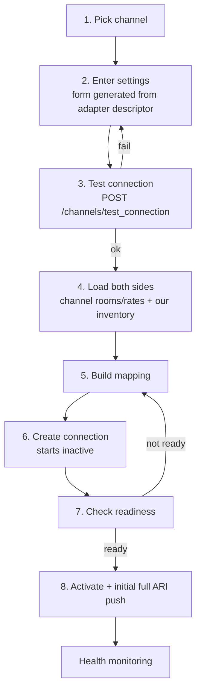

# 07 — Channels & Mapping

**Status:** `accepted` (2026-09-02) — implemented in M2: descriptor-driven wizard (CH-1..CH-4, CH-6), org-level `ChannelAccount` with Airbnb OAuth and bulk listing import with match-or-create (CH-5), mapping screen with confidence-scored suggestions, coverage warnings, cross-property and derived-plan validation, diff-before-save on live connections and targeted re-push (MAP-1..MAP-4, MAP-6), health board sorted worst-first with plain-language alerts (CH-7) and one-click reversible pause (CH-8), five-minute readiness poll. Not yet built: pattern/CSV bulk mapping and copy-from-property (MAP-5), per-channel revenue share (needs M6 rollups). Added 2026-09-03: Airbnb authorises through Channex, the approved Airbnb partner: `POST /meta/airbnb/connection_link` returns Airbnb's OAuth URL for the portfolio's live properties, the host returns to `/api/v1/channels/oauth/airbnb/callback` with the new `channel_id`, one inactive `ChannelConnection` per property points at it, the host's listings (`GET /channels/{id}/action/listings`) map to rate plans on the connection page, and activation pushes the listing mappings (`POST /channels/{id}/mappings`), activates and imports future reservations. The Channex channel iframe is embedded at `/channels/connect` for the remaining provider-only channels, with a pull that mirrors Channex's connections into `ChannelConnection` rows. Channel accounts are a step-up permission: the console re-authenticates before OAuth. Reconciled with Channex's Airbnb guide on 2026-09-05: an Airbnb account holds one provider channel shared by the portfolio, so a second authorisation passes the existing `channel_id` (re-connect); a listing mapping is confirmed by Airbnb asynchronously (about thirty seconds), so activation creates the missing mappings, skips the ones the connection already holds (Channex rejects a listing mapped twice) and waits for them to appear before activating; future reservations are loaded per listing (`{listing_id}` body); pausing or removing one property un-maps its listings (`DELETE /channels/{id}/mappings/{mapping_id}`) instead of deactivating the shared channel, which is deactivated only when no connection of the organisation uses it any more. Added 2026-09-06, from the competitor research (`docs/research/2026-09-competitors.md`): the CH-5 listing import now runs on the Channex connection: `GET /channels/{id}/action/listings` lists the host's listings not yet mapped, `GET /channels/{id}/action/listing_details` and `GET /channels/{id}/action/get_listing_calendar` supply title, place, capacity, photos, description and the host's per-day prices and minimum stays for the coming year; an unmatched listing becomes a `single_unit` property (Standard plan at the median price, calendar days written from Airbnb, content kept in `settings.content`), a matched one gets a mapped connection on the chosen property. Availability is not copied: Airbnb's blocks are its own bookings, loaded on activation.

**Primary personas:** `property_manager`, `portfolio_manager`, `revenue_manager`.

Mapping is where channel managers earn their support tickets. The Channex Channel
API is descriptor-driven — `GET /channels/adapter?code=…` returns the fields and
mapping requirements for each of 20+ adapters — so our UI must be **generated from
the descriptor**, never hard-coded per OTA. Hard-coding is how you end up shipping
a release every time an OTA adds a field.

## 7.1 Channel catalogue

A browsable grid of available adapters with, per channel: logo, name, region,
capabilities (rates, availability, restrictions, content, messaging, reviews,
virtual cards), what credentials are needed, expected setup time, and a link to
the channel-specific guide. Filter by "already connected", region, or capability.

## 7.2 Connection wizard

Mirrors the documented Channex connection flow, one screen per step, resumable,
with state persisted so a manager can stop and come back:

Requirements:

- **CH-1** Every settings form field, label, type, validation and help text comes
  from the adapter descriptor. Unknown field types degrade to a text input with a
  warning rather than blocking the flow.
- **CH-2** Credentials are encrypted on write and never returned to the client
  once saved (write-only fields show `••••` with a replace action).
- **CH-3** `test_connection` runs before creation, with the provider's error shown
  verbatim *and* translated into a likely cause and remedy.
- **CH-4** Connections are created inactive and only activated after readiness
  passes — matching Channex's own sequencing, so we never half-connect a channel.
  Readiness means "no gaps reported by the provider"; the provider's own
  `is_active` flag is not a gap before activation (Channex creates every channel
  switched off and activation is our call), and travels separately as
  `Readiness.inactive`, which the health poll treats as a regression once the
  connection is active. A failed activation always shows a reason on the console,
  even when the provider named none (fixed 2026-09-08: a fresh Channex channel was
  reported "not ready" with an empty list, could never activate, and the button
  still said "Active").
- **CH-5** **Airbnb is a primary path, not a branch**: OAuth authorise once at
  org level (`ChannelAccount`), import listings in bulk, and offer per-listing
  match-or-create against our properties. Inquiries, reservation requests and
  alteration requests from Airbnb are actionable tasks with deadlines
  ([05 §5.5.3](./05-channex-integration.md#553-event-catalogue-and-our-response)). Where an adapter is only supported through the
  **Channex channel iframe**, we embed it, clearly labelled, rather than faking a
  native flow we cannot support.
- **CH-6** Activation triggers a full ARI push for the configured horizon, with
  visible progress and an ETA.

## 7.3 The mapping screen

Two panes: **our inventory** (room types → rate plans, with occupancy) and **the
channel's** rooms and rates (from `POST /channels/mapping_details`). A mapping row
links one of ours to one of theirs.

Per row: our rate plan · channel room code · channel rate code · occupancy ·
rate type · optional `derived_option` (percent/amount, increase/decrease).

- **MAP-1** **Auto-suggest** with confidence scores from name similarity,
  occupancy match, price proximity and previously accepted mappings. Suggestions
  are always reviewable; nothing is auto-applied above the user's head.
- **MAP-2** **Coverage warnings before save**: unmapped room types, unmapped rate
  plans, a channel room with no mapping, occupancy levels the channel expects but
  we do not sell, and duplicate targets. Unmapped inventory is the direct cause of
  unmapped bookings ([05 §5.7](./05-channex-integration.md#57-unmapped-bookings)),
  so this list is loud.
- **MAP-3** Validation blocks cross-property references (INV-8) and mapping a
  derived plan where the channel expects a base rate.
- **MAP-4** A **diff view** before saving changes to a live connection: what will
  start selling, what will stop. Changing mappings on a live channel is a
  high-consequence act and is treated as one.
- **MAP-5** Bulk mapping for large properties (pattern match, CSV import) plus
  **copy mapping from another property** for portfolios with identical setups.
- **MAP-6** Mapping changes are audited with before/after and trigger a targeted
  re-push of the affected rate plans.

## 7.4 Channel health board

One card per connection, sorted worst-first, because the only thing a manager
wants on this page is "what is broken":

- state (`active`, `paused`, `error`, `disconnected`) and readiness
- last successful ARI push, per data type
- pending / failed cells attributable to this channel
- recent `sync_error`, `sync_warning`, `rate_error` events, in plain language
- bookings received (7/30 days), revenue, and share of channel mix
- unmapped bookings originating here
- credential expiry and OAuth token status, with days remaining

Alert handling:

| Signal | Severity | Presentation |
|---|---|---|
| `disconnect_channel`, `disconnect_listing` | **P1** | Banner + email + push: "You are not selling on X." One-click reconnect. |
| `channel_removal_warning`, `property_removal_warning` | **P1** | Deadline countdown and the exact required action. |
| Credentials invalid / expired | **P1** | Reconnect flow, queue paused for that channel. |
| Repeated `rate_error` | **P2** | Grouped by cause with a suggested fix (e.g. rate below the OTA's minimum). |
| Readiness regression | **P2** | Mapping gaps listed with jump links. |
| Elevated drift | **P2** | Force-resync action offered. |

- **CH-7** Every alert names the property, the channel, the business consequence
  and the next action. "Sync error 4092" alone is a bug in this spec.
- **CH-8** Pausing a channel is one click, reversible, and clearly explains that
  inventory stops updating (not that it stops selling).

## 7.5 Multi-property channel operations

**Primary, not auxiliary, for the STR segment.** An org-level `ChannelAccount`
holds shared credentials/OAuth tokens; connecting the same OTA across N listings
is one flow: pick the account, pick the listings, auto-map `single_unit`
properties (one room type, one rate plan — mapping is nearly deterministic),
review the exceptions, activate in bulk with a progress view. Plus a matrix view
of channel × property state and bulk pause/resume. This is the difference between
usable and unusable at 50 listings.

## 7.6 Acceptance criteria

- A manager can connect and map a Booking.com property in under 15 minutes, and
  connect 20 existing Airbnb listings in under 30, with no external documentation.
- Adding a new Channex adapter requires **zero** code changes in our repo.
- No connection can be activated while a mapping gap that would cause unmapped
  bookings exists, unless explicitly overridden and logged.
- A disconnected channel is visible within 60 seconds and communicated in language
  a hotelier understands.
