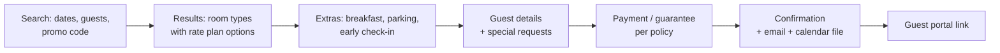

# 10 — Direct Booking Engine

**Status:** `accepted` — implemented in M7 (v0.6, 2026-09-02); see [§10.9](#109-implementation-notes-m7). Revised 2026-08-21: multi-property portfolio search is the default storefront.

**Primary personas:** the **guest**, plus `property_manager` and `revenue_manager`
who configure it.

Every OTA booking costs 15–25% commission. A direct channel is the highest-margin
inventory a property has, and in closed channel managers it is usually an
afterthought sold as an add-on. Here it is a first-class channel.

## 10.1 Architectural stance

**The direct channel is modelled as a `ChannelConnection` with
`adapter_code = "direct"`.** Availability, rates and restrictions therefore flow
through the same pipeline as any OTA, and a direct booking enters through the same
`Booking`/`BookingRevision` path as an OTA booking.

Consequences we want:

- one booking-creation code path for OTA, direct, and staff/walk-in
  ([08 §8.9](./08-operations-and-turnover.md#89-direct-and-walk-in-bookings));
- availability decrements identically, so direct sales cannot overbook the OTAs;
- channel-mix reporting includes direct without special-casing;
- rate parity is visible against real OTA prices in one table.

Search reads **our own** `AvailabilityDay` / `RateDay` tables — we are the source
of truth, so a direct search is a local query, fast and unaffected by provider
latency. Channex's **Booking CRS API**, **Open Channel API** and **Shopping API**
remain available for the inverse case (an operator who wants their engine
registered as a Channex channel, or wants to shop other inventory); the provider
port keeps that door open without complicating v1.

## 10.2 Guest booking flow

Requirements:

- **BE-1** Availability and price shown must be the price charged. Taxes and fees
  are itemised before payment, never revealed at the last step.
- **BE-2** Restrictions are honoured in search: min/max stay, CTA/CTD, stop-sell,
  cut-off and release rules.
- **BE-3** Multi-room and multi-room-type bookings in one transaction.
- **BE-4** Occupancy-aware pricing including children's ages, matching the rate
  plan configuration.
- **BE-5** A **hold** (default 15 min) reserves inventory during checkout and
  releases automatically on abandonment. Holds count against availability so we
  cannot double-sell the last room during a slow card entry.
- **BE-6** Idempotent submission — a double-clicked confirm button creates one
  booking.
- **BE-7** Confirmation email in the guest's language with a portal magic link and
  an `.ics` attachment.
- **BE-8** Full audit trail from search to confirmation for dispute resolution.

## 10.3 Distribution and embedding

- **Hosted page** at a per-property path or custom domain, server-rendered for SEO.
- **Embeddable widget** — one `<script>` tag plus a target element; renders in an
  iframe with `postMessage` resizing so it never breaks a hotel's WordPress theme.
- **Deep links** honouring dates, promo code, room type and language, so campaigns
  can land directly on results.
- **Portfolio storefront is the default**: multi-listing search with a map, dates,
  guests and attribute filters (pets, pool, workspace) — an STR manager sells a
  portfolio, not a property. Single-property pages exist per listing beneath it.
- **White-label theming**: logo, colours, fonts, custom CSS, per property.
- **Localisation**: full i18n, RTL, per-locale currency display with a clear
  statement of the charge currency.

Non-functional:

- **BE-9** LCP < 2.0 s on a mid-range mobile over 4G; the widget's initial JS
  payload under 100 kB gzipped.
- **BE-10** WCAG 2.2 AA on the entire funnel, keyboard-completable end to end.
- **BE-11** No third-party trackers by default. Analytics and pixels are opt-in per
  property with a consent banner, and the engine works fully with consent denied.

## 10.4 Payments

Through the `PaymentProvider` port; **Stripe** is the reference implementation, and
Channex's payment application / Stripe tokenisation app is supported for
properties already using it.

- Policy-driven guarantee: card-on-file, deposit (fixed or %), full prepayment, or
  pay-at-property.
- SCA / 3-D Secure where applicable; failures surface as recoverable, with a retry
  that does not lose the booking form.
- **We never see a PAN.** Card fields are provider-hosted elements; our servers
  receive a token ([13](./13-nfr-security-compliance.md)).
- Refunds and cancellation fees are computed from the policy and executed under
  step-up auth.
- Multi-currency: display currency vs charge currency always stated explicitly.

## 10.4b Payment rules

An organisation collects a direct booking in named instalments (`payment_rule`): a share of the
stay, a fixed amount, or everything still owed, due at booking confirmation or a number of days
before or after arrival, scoped to properties and channels and applied in `position` order. A
rule never overshoots the stay: each takes at most what is unallocated, and a `remainder` rule
closes the plan exactly. A moment already past is due on the day of booking, never in the past.

`planPayments()` in `packages/core/src/booking-engine/payment-rules.ts` is the pure function,
covered by property tests; confirmation writes the instalments due after today into
`payment_schedule`, and the daily `payments.collect` job charges each one through the
`PaymentProvider` with `schedule:<id>` as the idempotency key, records it on the folio, and
cancels the rest when a booking is cancelled. Attempts stop after six failures. The console page
is Direct bookings → Payment rules, with a worked example on a 1 000.00 stay.

## 10.5 Direct-only commercial tools

- **Promo codes** — percentage or amount, date and stay constraints, usage caps,
  single-use codes.
- **Direct-only rate plans** — mapped to the direct channel and nowhere else, which
  is the entire point of parity-compliant direct discounting.
- **Upsells and extras** — breakfast, parking, transfers, early/late checkout,
  posted to the folio as charges.
- **Abandonment recovery** — an optional email to a guest who entered contact
  details and did not complete, subject to consent, throttled, and off by default.
- **Best-rate messaging** — an honest comparison against the mapped OTA price for
  the same dates, using our own parity data rather than a scraped guess.

## 10.6 Guest portal

Magic-link authenticated, scoped to one booking, no account required.

- View and download the reservation and invoice.
- **Online pre-check-in**: guest details, ID/passport upload where legally
  required, arrival time, preferences — feeding the front desk board and cutting
  arrival queues.
- Purchase extras and upgrades.
- **Access code reveal** at the configured time before arrival, plus arrival
  instructions and house manual — the portal is how guests reach an empty flat.
- Message the property (creating a `direct` thread in the unified inbox).
- Self-service cancellation or date change **only where the policy allows it**,
  with the fee shown before confirming.
- Post-stay: invoice, review link.

Security: single-use, short-lived, rate-limited links; no enumeration of other
bookings; every portal action audited as an `actor_type = guest` entry.

## 10.7 Roadmap beyond v1

Metasearch and Google Hotel Ads free booking links (via the Channex adapters where
available), corporate/negotiated-rate portals with company logins, gift vouchers,
and a multi-property loyalty/member rate scheme.

## 10.8 Acceptance criteria

- A guest can book a room on a phone in under 90 seconds, keyboard-only if needed.
- A direct booking decrements OTA availability within seconds, through the same
  path as an OTA booking.
- A restriction set in the calendar is immediately respected by the engine.
- The property pays 0% commission, and the channel-mix report shows the saving in
  money.

## 10.9 Implementation notes (M7)

What v0.6 ships, where it lives, and where it deliberately stops short of the text above.

- **Direct channel.** `enableDirectChannel` creates a `channel_connection` with
  `adapter_code = "direct"` (state `active`) and links it from `booking_engine_settings`.
  Rate plans marked `direct_only` are excluded from OTA mappings by the search query, so
  "mapped to the direct channel and nowhere else" is a column, not a convention (§10.5).
- **Search** is `searchOffers()` in `packages/core/src/booking-engine/search.ts`: local ARI only,
  occupancy pricing from `rates[party]` (BE-4), every restriction through the same
  `checkSellable` the staff path uses (BE-2). A fast-check property proves no offer ever
  violates a restriction or a held/booked night.
- **Holds (BE-5).** `booking_hold` rows count against availability: `recomputeAvailability`
  subtracts live holds next to bookings and blocks, so the decrement reaches every OTA through
  the ordinary push. Expiry is 15 minutes, swept every minute by `holds.expire`.
- **Confirm (BE-6)** runs in three phases so no card call happens inside a tenant transaction:
  claim the hold under the confirm button's idempotency key, talk to the `PaymentProvider`,
  then apply the booking on the one revision path (`applyDirectRevision`, shared with staff
  bookings). A second confirm with the same key returns the same booking; a decline keeps the
  hold and hands the guest a new attempt key.
- **Payments (§10.4).** `StripePaymentProvider` speaks the PaymentIntents REST API over the
  `HttpTransport` port and is unit-tested with a fake transport; `FakePaymentProvider` drives
  tests and the demo (`tok_decline`, `tok_3ds`). The checkout marks a `data-payment-mount`
  element for hosted fields; nothing from a payment provider loads by default (BE-11).
  *Deferred:* card-on-file vaulting through a SetupIntent (the guarantee is accepted, no
  instrument is stored in v0.6); multi-room bookings in one transaction (BE-3, one room type
  per hold today).
- **Confirmation (BE-7).** Mail template `booking_confirmation` in the guest's locale with an
  `.ics` (`icsFor`) and the portal link. **Audit (BE-8):** hold, confirm, portal messages and
  cancellations are `actor_type = guest` audit entries on the org chain.
- **Storefront and embed (§10.3).** `/book` is the portfolio page (dates, guests, attribute
  filters, a dependency-free SVG map from stored coordinates), `/book/<property>` the property
  page with deep links, `/widget.js` (under 1 kB) the embed: an iframe plus `postMessage`
  resizing; `/book/*` sends `frame-ancestors *`, everything else `SAMEORIGIN`. Theming is a
  per-property colour in v0.6; fonts and custom CSS are deferred. BE-9 is checked in e2e as a
  navigation-timing budget on the storefront; BE-10 by a keyboard-only run of the funnel (an
  axe audit is on the M8 list, the tool is not vendored yet).
- **Direct-only tools (§10.5).** Promo codes (`promo_code`, percent or amount, validity, caps,
  single use), extras posted to the folio at confirm and from the portal, abandonment mails
  (`holds.abandoned`, hourly, consent and per-property opt-in required, one mail per checkout,
  `recovery_mailed_at`). Best-rate messaging against OTA parity is deferred.
- **Guest portal (§10.6).** `guest_session` tokens from the confirmation mail, cookie `pms_guest`,
  the `withGuestSession` action wrapper (recognised by the handler build check). Pre-check-in
  feeds `pre_checkin`; the door code is revealed `access_reveal_hours` before `valid_from`;
  messages land as inbound entries on the booking's `direct` thread; cancellation follows the
  property policy with the fee shown first and the card refunded through the provider.
  *Deferred:* ID upload, invoice download, the review link.

