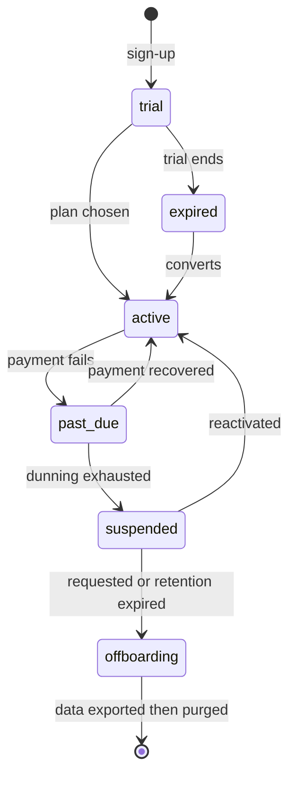

# 12 — Platform Administration & Billing

**Status:** `review` — revised 2026-08-21: hosted SaaS ships at launch (D4), so billing and quotas are v1 scope (M8). The parity guarantee is unchanged.

This spec covers the operator's side: the console, tenant lifecycle, quotas,
support tooling, plugins, and — for anyone running the SaaS mode — billing.

**Parity guarantee:** nothing in this spec may cripple the self-hosted build. A
self-hoster gets the full product; the billing module is simply unconfigured and
its UI absent. Feature flags exist for rollout and experiments, **never** to
paywall functionality in the open-source distribution.

## 12.1 Operator console

Lives outside tenancy, accessible only to `platform_operator`, with every action
audited into both the operator log and the affected tenant's log.

| Area | Contents |
|---|---|
| **Fleet health** | Queue depths, job failure rates, DLQ sizes, provider error/429 rates, webhook processing lag, worst-N properties by pending ARI cells or unacked bookings. |
| **Tenants** | Search, plan, property count, state, connectivity provider and environment, last activity, open incidents. |
| **Sync inspector** | Per property: recent provider calls with redacted payloads, response codes, timings; retry, force-resync, replay-webhook actions. This is the tool that resolves 80% of support tickets. |
| **DLQ management** | Inspect, requeue, bulk-replay, discard with a reason. |
| **Webhook explorer** | Inbound webhooks with dedupe keys and processing state; replay individual events. |
| **Provider status** | Circuit-breaker state per org, adaptive rate-limit level, credential validity. |
| **Feature flags** | Per-tenant and percentage rollout, with an audit of who flipped what. |
| **Announcements** | In-app banners for maintenance and incidents, targetable by tenant. |
| **Impersonation** | Request, approval state, active sessions, full transcript ([02 §2.7](./02-personas-and-rbac.md#27-impersonation-and-break-glass)). |
| **Jobs** | Manually trigger reconciliation, rollups, night audit, retention purges. |

**OPS-1** No operator screen may display guest PII or message bodies by default.
Reaching that data requires an approved impersonation session, and the screens are
designed so support can diagnose without it — errors, states and IDs, not names.

## 12.2 Runbooks

`docs/runbooks/` is part of the deliverable, not documentation debt. Minimum set:

`ari-drift-detected` · `channel-disconnected` · `bookings-not-arriving` ·
`unacked-bookings-growing` · `provider-429-storm` · `provider-outage` ·
`webhook-endpoint-down` · `overbooking-incident` · `night-audit-failed` ·
`payment-provider-failure` · `restore-from-backup` · `rotate-channex-key` ·
`gdpr-erasure-request` · `security-incident` · `upgrade-and-rollback`.

Each states: symptom, how to confirm, blast radius, immediate mitigation, root-cause
steps, and who to tell.

## 12.3 Tenant lifecycle

- **Onboarding** — sign-up, org creation, Channex credential entry (or a guided
  Channex account creation), property wizard, first channel connected, first ARI
  push. A visible checklist with progress, because time-to-first-value is the whole
  adoption story.
- **Suspension** — degraded, not destroyed: **ARI sync keeps running and bookings
  keep being ingested and acknowledged**, while UI access is restricted. Suspending
  sync would cause overbookings and harm guests who did nothing wrong. This is a
  deliberate, non-negotiable choice.
- **Offboarding** — full data export (bookings, guests, ARI history, messages,
  invoices) in documented JSON + CSV, a 30-day grace period, then hard purge with a
  certificate of deletion. **No hostage data, ever** — it is the reason to choose an
  open platform.

## 12.4 Quotas and fair use (SaaS mode)

Per plan: properties, rooms, users, API requests/minute, webhook endpoints,
retention window, storage for attachments and exports.

**QUOTA-1** Exceeding a quota never breaks connectivity. We warn, then throttle
non-critical work (reports, exports, bulk operations); ARI sync, booking ingest and
ack are exempt. Losing a booking to a quota would be indefensible.

## 12.5 Billing (hosted service; v1 scope)

- **Plan model** — **per active unit per month** with volume tiers (STR managers
  count units, not properties), plus optional add-ons (priority support). The
  booking engine and owner portal are included in every plan — they are product,
  not upsells. Annual discount.
- **Metering** — nightly `UsageRecord`s of active units; billed on the peak within
  the period, which matches how portfolios actually grow.
- **Provider** — Stripe Billing behind a `BillingProvider` port so another
  processor can be substituted.
- **Invoicing** — automatic, with VAT/GST handling and reverse charge for EU B2B,
  tax IDs, and PDF delivery.
- **Dunning** — retry schedule, escalating notices, grace period, then suspension
  per §12.3.
- **Self-service** — plan changes with proration, payment method updates, invoice
  history, cancellation with an export prompt (never a retention dark pattern).
- **BILL-1** Billing failures must never affect connectivity or data integrity.
- **BILL-2** Every charge is explainable from usage records the customer can see.

## 12.6 Support tooling

Cross-cutting audit search (actor, subject, action, time, property), a per-tenant
timeline mixing audit + sync + channel events, a "diagnostics bundle" a tenant can
generate and attach to an issue (redacted config, health snapshot, recent errors,
trace IDs), and in-app support context so a report arrives with the property, trace
and version already attached.

## 12.7 Plugins and extensibility

The pressure valve that keeps core small ([01 §1.4](./01-vision-and-scope.md#14-what-we-are-explicitly-not)).

- **Extension points:** domain event subscribers, scheduled jobs, custom dashboard
  widgets, report definitions, message-template functions, provider
  implementations (payment, notification, LLM, connectivity), settings pages,
  webhook transformers.
- **Manifest** declares permissions requested, extension points used, config
  schema, and compatible core versions. Installation shows the permission grant
  explicitly.
- **Isolation:** plugins run out-of-process (v1: server-side webhooks and
  containerised workers) with scoped API tokens, per-plugin rate limits, timeouts
  and circuit breakers. **A misbehaving plugin may never delay an ARI push or a
  booking ack.**
- **Registry:** a signed, versioned index; self-hosters may point at their own.
- Reference plugins we ship: accounting export (Xero/QuickBooks CSV), Slack
  notifications, door-lock integration example, competitor rate shopper stub,
  LLM reply assistant.

## 12.8 Upgrades and operations

- **SemVer** for the API and plugin interfaces; breaking changes only on major
  releases, with a deprecation window of two minor versions.
- **Forward-only migrations**, tested against a production-shaped dataset, run as an
  explicit job; every release documents its expected migration duration.
- **Backups** — nightly full plus WAL/PITR, restore tested quarterly, and a
  documented one-command restore for self-hosters. An untested backup is not a
  backup.
- **Zero-downtime deploys** for the API; workers drain gracefully so no job is
  killed mid-push.
- **Version and trace visible in the UI footer**, so bug reports are actionable.

## 12.9 Acceptance criteria

- An operator can diagnose "my rates are not updating" from the console without
  database access and without seeing guest data.
- A suspended tenant still has correct availability on every OTA.
- A tenant can export everything they own and leave, unaided, in under an hour.
- Installing a plugin cannot degrade sync latency.
